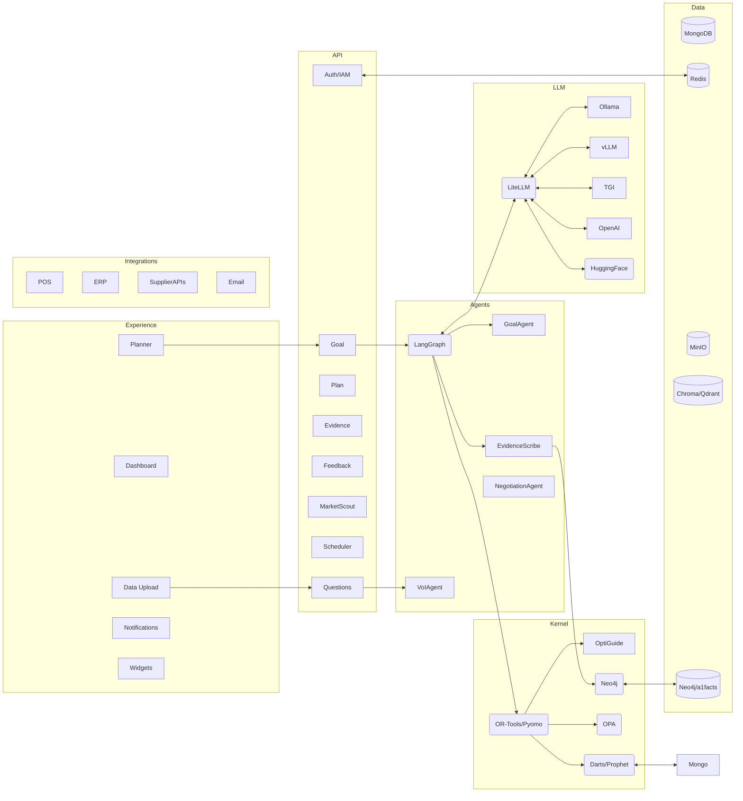
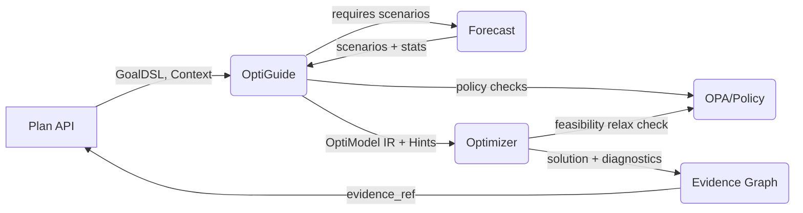
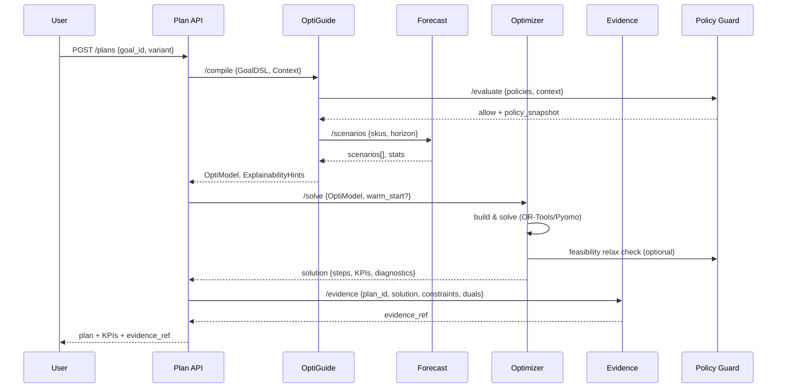

# Dyocense Platform — Architecture & Design (Detailed .md)

> End‑to‑end architecture and design reference for the Dyocense Goal‑to‑Plan intelligence engine.

---

## 1) Vision Snapshot

- **Mission:** Translate SMB goals into optimized, auditable, continuously improving plans.
- **KPIs:** Cost ↓ 3–10%, Waste ↓ 15–20%, Service ≥ 97%, Time saved ≥ 3 hrs/week.
- **Core Loop:** Goal → Clarify (VoI) → Plan (optimize) → Execute → Collect Actuals → Compare → Learn → Next Plan.

---

## 2) Architecture Layers

### Experience Layer

- Conversational Planner (Next.js, Tailwind, ShadCN)
- Dashboard (Recharts, Superset/Metabase optional)
- Data Upload Wizard (CSV/XLSX)
- Notifications (Email/Slack/WhatsApp)
- Embeddable Widgets (, )

### API Layer (FastAPI)

- Goal API, Questions API, Plan API, Evidence API, Feedback API, MarketScout API, Scheduler API, Negotiation API, Auth/IAM API.
- Features: OpenAPI, Swagger/Redoc, JWT auth, rate‑limits.

### Agent Layer

- **LangGraph Conductor**: flow orchestration
- **Agents**: GoalAgent, VoIAgent, EvidenceScribe, NegotiationAgent
- **Experimental**: AutoGen, AgentScope for advanced coordination

### LLM & Model Layer

- **Router:** LiteLLM/OpenRouter
- **Local Serving:** Ollama (llama.cpp, Mistral, Phi‑3), HuggingFace PEFT
- **Cloud Fallback:** OpenAI/Anthropic APIs
- **Backends:** vLLM, TGI
- **Prompt Registry:** DSPy/Guidance + Guardrails.ai
- **Evaluation:** Ragas, DeepEval, Promptfoo

### Decision Kernel

- **OptiGuide:** GoalDSL → MILP compiler
- **Optimization:** OR‑Tools (CP‑SAT), Pyomo, PuLP (fallback)
- **Forecasting:** Darts, Prophet, Monte Carlo sims
- **Policy Guard:** OPA/OPAL, allow/block lists, spend caps
- **Evidence Graph:** Neo4j/a1facts with provenance edges

### Data Layer

- MongoDB (operational plans/goals, service persistence)
- Redis (cache/queue)
- MinIO (files/artifacts)
- Chroma/Qdrant (RAG, embeddings)
- Neo4j (Evidence Graph)

### Integrations

- POS (Shopify/Toast)
- ERP/Accounting (Xero, QuickBooks)
- Supplier APIs/Scrapers
- Email (SMTP/OAuth)

---

## 3) Logical Architecture (Mermaid)



---

## 4) Technology Stack

- **Frontend:** Next.js, Tailwind, ShadCN/UI, Recharts, Framer Motion
- **Backend:** FastAPI, Pydantic v2, Motor/PyMongo, Uvicorn, Celery/RQ
- **Agents:** LangGraph, AutoGen, AgentScope
- **LLM Serving:** LiteLLM router, vLLM, TGI, Ollama, HuggingFace
- **Optimization:** OptiGuide, OR‑Tools, Pyomo, PuLP
- **Forecasting:** Darts, Prophet, NumPy Monte Carlo
- **Data Stores:** MongoDB, Redis, MinIO, Neo4j, Chroma/Qdrant
- **Policy & IAM:** Keycloak, OPA/OPAL, Permit.io future
- **DevOps:** Docker Compose, Helm, ArgoCD, GitHub Actions, OpenTelemetry, Prometheus/Grafana, Loki, Tempo
- **Security:** SBOM (Syft/Grype), cosign, External Secrets/Vault

---

## 5) Deployment View

- **Local:** Docker Compose with seeded demo data (MongoDB, Redis, Neo4j)
- **Staging:** AKS/K3s, GitHub Actions CI, preview envs
- **Prod:** Multi‑AZ, HPA, MongoDB replica set, Redis HA, MinIO lifecycle policies

---

## 6) Roadmap

**Phase 1 — MVP**

- CSV ingestion, Goal→Plan flow, Evidence Graph, PDF/email export, manual feedback upload, local LLM via Ollama.

**Phase 2 — Growth**

- Scheduler, notifications, supplier scorecards, demand forecasting, negotiation assistant, POS/accounting integrations, vLLM/TGI GPU serving, RAG (Chroma/Qdrant).

**Phase 3 — Marketplace**

- Shopify/Xero/Toast apps, multi‑goal/multi‑location, experiment engine, consultant white‑label, group purchasing.

---

## 7) ADR Index

- **ADR‑001:** OR‑Tools + OptiGuide for optimization
- **ADR‑002:** LiteLLM as router; Ollama + cloud fallback
- **ADR‑003:** LangGraph orchestration; AutoGen/AgentScope optional
- **ADR‑004:** Neo4j Evidence Graph
- **ADR‑005:** Docker Compose + Helm + ArgoCD
- **ADR‑006:** RAG via Chroma/Qdrant + LlamaIndex/Haystack
- **ADR‑007:** OpenTelemetry + Prometheus/Grafana stack

---

## 8) Open Questions

- Default model set for pilots (Llama‑3, Mistral, Phi‑3)?
- Which RAG store (Chroma vs Qdrant) suits SMB hosting best?
- Minimum viable supplier integrations for UK SMB launch?


---

# Kernel — End-to-End DESIGN

> How the Dyocense **Decision Kernel** (Forecast → OptiGuide → Optimizer → Evidence) works as a single pipeline, including policies, configs, contracts, telemetry, and failure modes.

## 0) Scope

Covers the four kernel modules and their contracts with API layer & policy engine:

- **Forecast** → scenarios & stats
- **OptiGuide** → compile GoalDSL + context + scenarios → OptiModel IR + Explainability Hints
- **Optimizer** → solve IR → solution + diagnostics
- **Evidence Graph** → persist provenance, KPIs & sensitivities
- **Policy Guard (OPA)** → allow/deny, caps, vendor rules (consulted by OptiGuide/Optimizer)

---

## 1) High-level Flow



### Narrative

1. **Plan API** hands GoalDSL + planning context to **OptiGuide**.
2. OptiGuide requests **Forecast** scenarios (demand/lead-time) and compiles the model.
3. **Optimizer** solves the IR with warm-starts and returns solution + diagnostics.
4. **Evidence Graph** records constraints, duals/activities, scenario IDs, KPIs; returns `evidence_ref`.

---

## 2) End-to-End Sequence



---

## 3) Contracts (Schemas — excerpts)

### 3.1 `/forecast/scenarios` → `ScenarioSet`

```json
{
  "horizon": 4,
  "num_scenarios": 50,
  "skus": ["MILK-1L"],
  "scenarios": [
    {"id": 0, "demand": {"t1": 120, "t2": 110}, "lead_time_days": 2},
    {"id": 1, "demand": {"t1": 95,  "t2": 140}, "lead_time_days": 3}
  ],
  "stats": {"MILK-1L": {"mean": 115.2, "sigma": 18.5, "p95": 143}}
}
```

### 3.2 `/optiguide/compile` → `OptiModel` + `ExplainabilityHints`

```json
{
  "optimodel": {
    "vars": {"x[sku,supplier,period,scenario]": {"type":"int","lb":0}},
    "obj": {"sense": "min", "terms": [{"name":"cost","expr":"sum(price*x)","weight":0.6}]},
    "constraints": [{"name":"budget","expr":"sum(price*x)<=8000"}],
    "robust": {"scenarios": 50, "aggregation":"p95"}
  },
  "hints": {"track": ["budget","moq","balance","lead_time"], "sensitivities": ["price","moq"]}
}
```

### 3.3 `/optimizer/solve` → `Solution`

```json
{
  "status": "FEASIBLE",
  "gap": 0.012,
  "kpis": {"total_cost": 7821.4, "service": 0.975, "co2": 123.5},
  "steps": [
    {"sku":"MILK-1L","supplier":"S1","qty": 120,"price":0.79,"period":"t1"}
  ],
  "binding_constraints": ["budget","moq"],
  "activities": {"budget":8000,"balance_t2":0},
  "shadow_prices": {"budget": 0.03}
}
```

### 3.4 `/evidence/write` → `EvidenceRef`

```json
{"evidence_ref":"neo4j://run/3f9a...", "snapshot_hash":"sha256:..."}
```

---

## 4) Error & Recovery Paths

- **Infeasible model** → Optimizer runs IIS/relaxation; returns minimal relaxing slacks; Plan API surfaces *"which constraints to relax"*.
- **No/poor history** in Forecast → fall back to naive + wider σ; OptiGuide adds safety stock term.
- **Policy denial** → early fail from OptiGuide with human‑readable message & offending rule.
- **Timeout** → return best‑found solution with `status=FEASIBLE` & `gap`.

---

## 5) Configuration (defaults)

```json
{
  "forecast": {"num_scenarios": 50, "horizon": 4, "model":"auto"},
  "optimizer": {"time_limit_sec": 20, "mip_gap": 0.02, "threads": 0},
  "robust": {"aggregation": "p95"},
  "explainability": {"track": ["budget","moq","balance","lead_time"], "sensitivities": ["price","moq"]}
}
```

---

## 6) Telemetry & SLOs

- **Tracing (OTel spans):** `kernel.compile`, `kernel.forecast`, `kernel.solve`, `kernel.evidence.write`.
- **Metrics:** `solver_wall_time`, `mip_gap`, `status_code`, `forecast_rmse`, `scenario_count`, `evidence_write_ms`.
- **SLOs:** P50 compile < 300ms; P50 solve < 20s; P95 end‑to‑end < 90s.

---

## 7) Security & Policy Hooks

- JWT propagated with tenant; OptiGuide queries OPA for *vendor allow/deny*, *spend caps*.
- Evidence Graph redacts PII; snapshots hashed in MinIO.

---

## 8) Test Strategy

- **Golden tests** for GoalDSL→OptiModel.
- **Scenario regression** for Optimizer across seed datasets.
- **Forecast backtests** with time‑series CV.
- **Property tests**: budget monotonicity (cost non‑decreasing as budget shrinks), feasibility under relaxations.

---

## 9) Future Extensions

- CVaR objective for tail risk; Benders‑style decomposition for large scenarios; on
