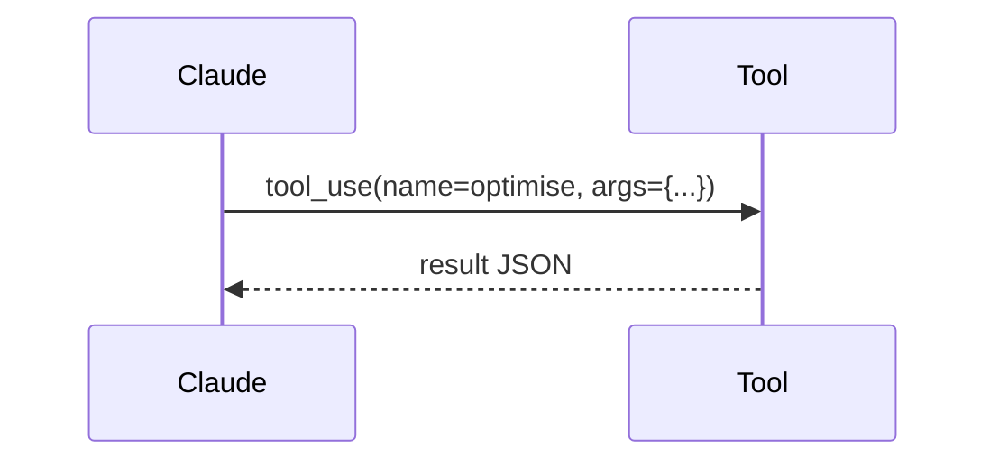

# Anthropic Tool Use Adapter
Exposes DDKP functions via Anthropic's `tool_use` schema.

---

## 💡 Purpose
- Easy integration with Claude Workbench and runtime

## 🔁 Functional Flow (high level)

## 📥 Inputs
- `tools=[{name, description, input_schema}]`

## 📤 Outputs
- JSON mirroring our API results

## 🔌 API (REST/gRPC) — Contract Snapshot
Tool declarations; REST bridge

## 🧠 Agent Integration Notes
- Provide few-shots to steer when to call `optimise`

## 🧪 Example
Claude emits tool_use; adapter POSTs to /v1/optimise

## 🧱 Configuration
- `ANTHROPIC_API_KEY`
- `API_BASE`

## 🚨 Errors & Fallbacks
- **Schema errors**: return `tool_result` with error details

## 📊 Telemetry & Events
- OpenTelemetry spans: adapter.anthropic.call
- CloudEvents: N/A

## 💻 Local Dev
- `python adapters/agent/anthropic_tool/app.py`

## ✅ Test Checklist
- [ ] Unit tests for happy path
- [ ] Schema validation errors
- [ ] Timeout + retry behavior
- [ ] OTel traces present
- [ ] CloudEvents emitted
