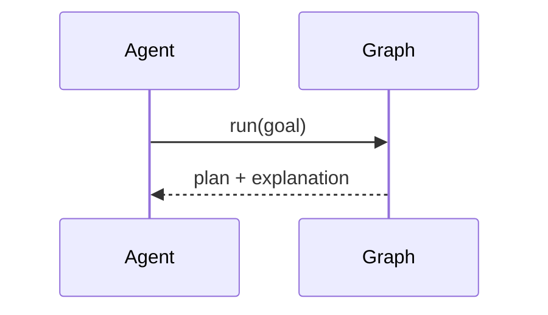

# LangChain / LangGraph Adapter
Provides `DecisionSolverTool` and graph nodes for compile/forecast/optimise/explain/diagnose.

---

## 💡 Purpose
- Drop-in tool/nodes for agent graphs

## 🔁 Functional Flow (high level)

## 📥 Inputs
- Tool run arguments; shared state

## 📤 Outputs
- `state['ops']`, `state['pack']`, `state['explanation']`

## 🔌 API (REST/gRPC) — Contract Snapshot
Python/TS SDKs call REST/gRPC under the hood

## 🧠 Agent Integration Notes
- Provide retries and timeouts per node

## 🧪 Example
agent.run('Plan rota under £5k')

## 🧱 Configuration
- `API_BASE`, `API_KEY`

## 🚨 Errors & Fallbacks
- **Node failure**: retry w/ backoff; bubble user-friendly message

## 📊 Telemetry & Events
- OpenTelemetry spans: adapter.langgraph.node.*
- CloudEvents: N/A

## 💻 Local Dev
- `pip install dyocense-sdk`

## ✅ Test Checklist
- [ ] Unit tests for happy path
- [ ] Schema validation errors
- [ ] Timeout + retry behavior
- [ ] OTel traces present
- [ ] CloudEvents emitted
