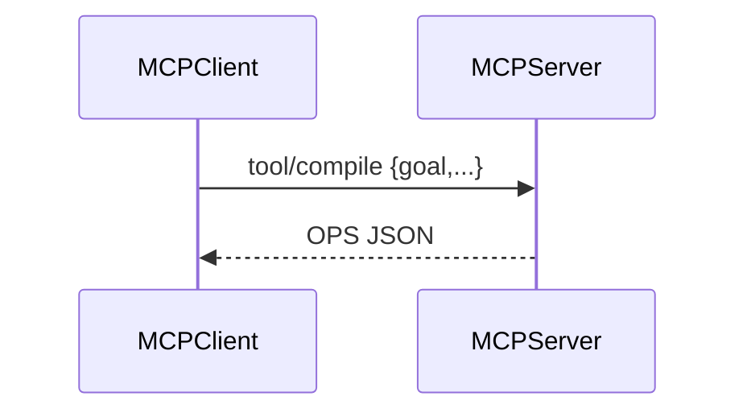

# MCP Adapter (Model Context Protocol)
Exposes DDKP tools (`compile`, `optimise`, `forecast`, `explain`, `diagnose`) as an MCP Server for agent runtimes.

---

## 💡 Purpose
- Allow MCP clients (Claude Desktop, IDE agents) to call decision tools locally or remotely

## 🔁 Functional Flow (high level)

## 📥 Inputs
- MCP `tool.use` requests with validated schemas

## 📤 Outputs
- Tool responses mapped to our API outputs

## 🔌 API (REST/gRPC) — Contract Snapshot
`mcp://tools/compile` etc. (JSON-RPC); mirrors REST contracts

## 🧠 Agent Integration Notes
- Package as a binary or Node/Python server following MCP spec

## 🧪 Example
mcp-cli call compile '{"goal":"Order planning"}'

## 🧱 Configuration
- `MCP_TRANSPORT` (stdio|ws)
- `API_BASE`

## 🚨 Errors & Fallbacks
- **Schema mismatch**: MCP error w/ path
- **Transport drop**: restart and resume

## 📊 Telemetry & Events
- OpenTelemetry spans: mcp.server.call
- CloudEvents: (optional) emit over local bus

## 💻 Local Dev
- `python adapters/agent/mcp/server.py`

## ✅ Test Checklist
- [ ] Unit tests for happy path
- [ ] Schema validation errors
- [ ] Timeout + retry behavior
- [ ] OTel traces present
- [ ] CloudEvents emitted
