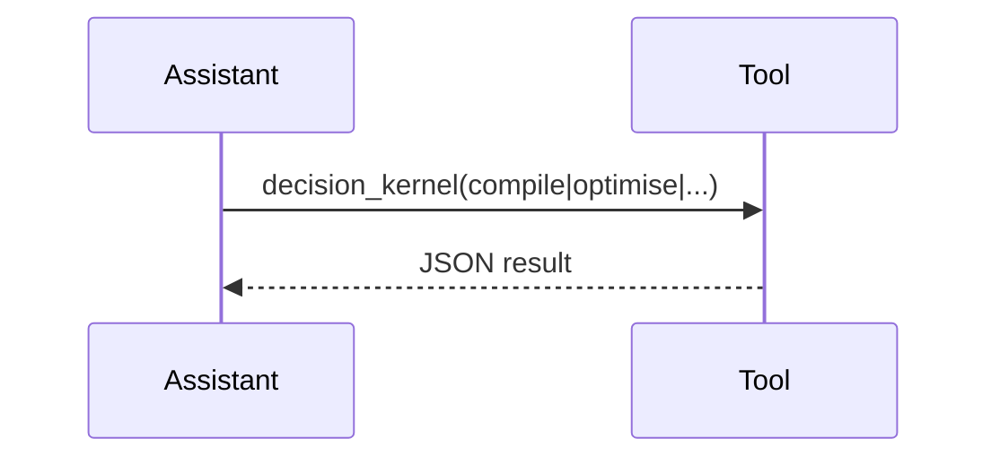

# OpenAI Assistants Tool Adapter
Registers DDKP endpoints as OpenAI Tools for Assistants to call.

---

## 💡 Purpose
- One-line integration from ChatGPT to Dyocense decision tools

## 🔁 Functional Flow (high level)

## 📥 Inputs
- Tool call payloads as per schema

## 📤 Outputs
- OPS / SolutionPack / Explanation

## 🔌 API (REST/gRPC) — Contract Snapshot
Tool manifest JSON; REST calls to our endpoints

## 🧠 Agent Integration Notes
- Include disambiguation prompt to route plan/schedule/optimise intents

## 🧪 Example
Assistant detects 'optimise' → calls tool with goal

## 🧱 Configuration
- `OPENAI_API_KEY`
- `API_BASE`

## 🚨 Errors & Fallbacks
- **Tool timeout**: Assistant can re-try; keep idempotent

## 📊 Telemetry & Events
- OpenTelemetry spans: adapter.openai.call
- CloudEvents: N/A

## 💻 Local Dev
- `node adapters/agent/openai_tool/index.js`

## ✅ Test Checklist
- [ ] Unit tests for happy path
- [ ] Schema validation errors
- [ ] Timeout + retry behavior
- [ ] OTel traces present
- [ ] CloudEvents emitted
