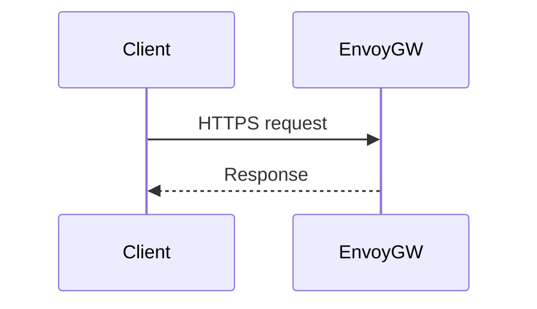

# API Gateway (Envoy Gateway)
Exposes public API, enforces authnz, rate limits, and routes to services.

---

## 💡 Purpose
- Present stable OpenAPI surface; protect backend services

## 🔁 Functional Flow (high level)

## 📥 Inputs
- HTTPS requests with Bearer tokens

## 📤 Outputs
- Routed responses; 401/403 on violation

## 🔌 API (REST/gRPC) — Contract Snapshot
Envoy Gateway HTTPRoute + ext_authz (OPA)

## 🧠 Agent Integration Notes
- Tool manifests point to gateway URL

## 🧪 Example
kubectl apply -f deploy/gateway/httproute.yaml

## 🧱 Configuration
- `RATE_LIMITS`, `CORS`, `JWT_ISSUER`

## 🚨 Errors & Fallbacks
- **Auth fail**: 401
- **Quota**: 429

## 📊 Telemetry & Events
- OpenTelemetry spans: gateway.request
- CloudEvents: gateway.request.* (optional)

## 💻 Local Dev
- kind/k3d + Helm charts

## ✅ Test Checklist
- [ ] Unit tests for happy path
- [ ] Schema validation errors
- [ ] Timeout + retry behavior
- [ ] OTel traces present
- [ ] CloudEvents emitted
