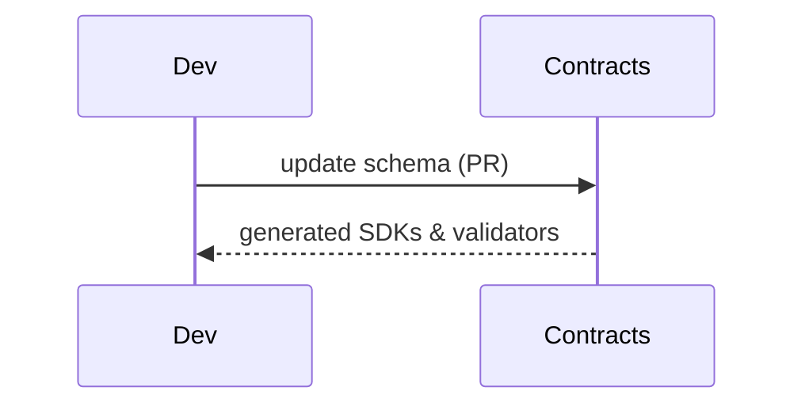

# Contracts — OpenAPI, JSON‑Schema, CloudEvents
Source of truth for API & data contracts used across all services and agent tools.

---

## 💡 Purpose
- Guarantee interoperability and versioned change management

## 🔁 Functional Flow (high level)

## 📥 Inputs
- Schema files (ops.schema.json, solutionpack.schema.json)

## 📤 Outputs
- Generated clients, validators, test fixtures

## 🔌 API (REST/gRPC) — Contract Snapshot
OpenAPI 3.1 in contracts/openapi; JSON‑Schemas in contracts/schemas; CloudEvents in contracts/cloudevents

## 🧠 Agent Integration Notes
- Tools reference these schemas for validation

## 🧪 Example
npm run generate:sdk  # from contracts/openapi

## 🧱 Configuration
- `VERSION` bump with SemVer

## 🚨 Errors & Fallbacks
- **Breaking change**: requires major bump

## 📊 Telemetry & Events
- OpenTelemetry spans: N/A
- CloudEvents: N/A

## 💻 Local Dev
- validate with ajv/pykwalify

## ✅ Test Checklist
- [ ] Unit tests for happy path
- [ ] Schema validation errors
- [ ] Timeout + retry behavior
- [ ] OTel traces present
- [ ] CloudEvents emitted
