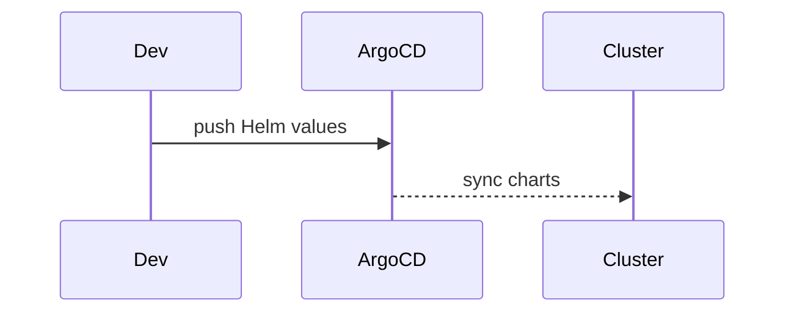

# Deploy — Helm & Argo CD
Declarative deployment of all services and infra via Helm charts and Argo CD.

---

## 💡 Purpose
- Reproducible environments; GitOps workflows

## 🔁 Functional Flow (high level)

## 📥 Inputs
- values.yaml per env

## 📤 Outputs
- running services

## 🔌 API (REST/gRPC) — Contract Snapshot
Helm charts in deploy/helm/*; Argo Applications in deploy/argo/*

## 🧠 Agent Integration Notes
- Publish stable endpoints for tools

## 🧪 Example
helm upgrade --install ddkp ./deploy/helm -n ddkp

## 🧱 Configuration
- `replicas`, `resources`, `image` tags

## 🚨 Errors & Fallbacks
- **ImagePullBackOff**: registry creds
- **Unschedulable**: adjust resources

## 📊 Telemetry & Events
- OpenTelemetry spans: N/A
- CloudEvents: N/A

## 💻 Local Dev
- kind + helmfile apply

## ✅ Test Checklist
- [ ] Unit tests for happy path
- [ ] Schema validation errors
- [ ] Timeout + retry behavior
- [ ] OTel traces present
- [ ] CloudEvents emitted
