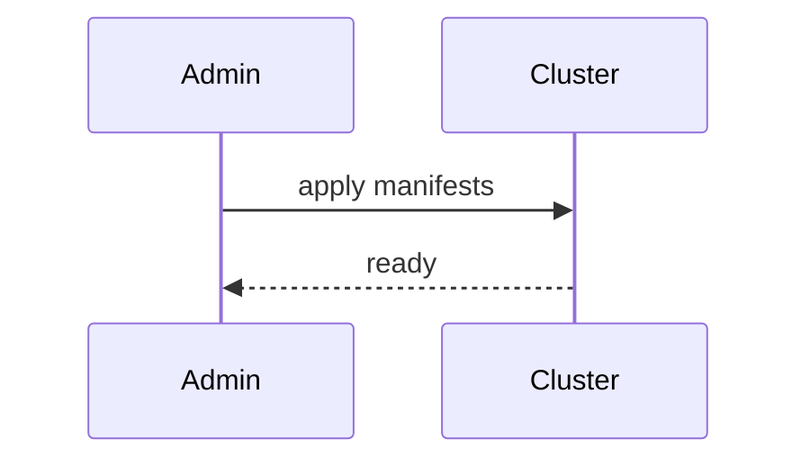

# Infra — Kubernetes Bootstrap (CNCF stack)
Brings up Keycloak, SPIRE, Envoy Gateway, OPA, Kyverno, KEDA, NATS, Postgres, MinIO, Redis, JanusGraph/Neo4j CE.

---

## 💡 Purpose
- One command to get a full OSS platform

## 🔁 Functional Flow (high level)

## 📥 Inputs
- kubeconfig, Helm charts

## 📤 Outputs
- running infra namespaces

## 🔌 API (REST/gRPC) — Contract Snapshot
Helm/Kustomize manifests under infra/k8s

## 🧠 Agent Integration Notes
- Expose gateway URL for tools

## 🧪 Example
make infra-up  # applies all base charts

## 🧱 Configuration
- storage class, node resources

## 🚨 Errors & Fallbacks
- **CRD conflicts**: version pinning
- **PVC pending**: storage class

## 📊 Telemetry & Events
- OpenTelemetry spans: N/A
- CloudEvents: N/A

## 💻 Local Dev
- k3d create cluster

## ✅ Test Checklist
- [ ] Unit tests for happy path
- [ ] Schema validation errors
- [ ] Timeout + retry behavior
- [ ] OTel traces present
- [ ] CloudEvents emitted
