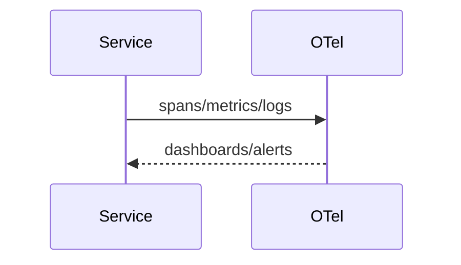

# Observability (OpenTelemetry, Prometheus, Grafana, Loki/Tempo)
Unified tracing, metrics, and logs for all services.

---

## 💡 Purpose
- Debug flows, enforce SLOs, show cost per solve

## 🔁 Functional Flow (high level)

## 📥 Inputs
- OTel SDK spans, metrics, structured logs

## 📤 Outputs
- Grafana dashboards, alerts

## 🔌 API (REST/gRPC) — Contract Snapshot
OTLP over gRPC/HTTP

## 🧠 Agent Integration Notes
- Expose trace_id to agents for support

## 🧪 Example
export OTEL_EXPORTER_OTLP_ENDPOINT=http://otel:4317

## 🧱 Configuration
- `OTEL_SERVICE_NAME`, sampling ratio

## 🚨 Errors & Fallbacks
- **Dropped spans**: check sampling/buffer

## 📊 Telemetry & Events
- OpenTelemetry spans: *
- CloudEvents: decision.* forwarded to webhooks

## 💻 Local Dev
- docker compose up prom grafana loki tempo

## ✅ Test Checklist
- [ ] Unit tests for happy path
- [ ] Schema validation errors
- [ ] Timeout + retry behavior
- [ ] OTel traces present
- [ ] CloudEvents emitted
