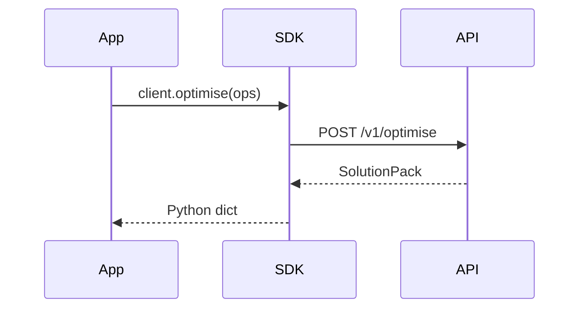

# Python SDK
Thin client for /compile, /optimise, /forecast, /explain, /diagnose with retries & schema validation.

---

## 💡 Purpose
- Make it trivial to call the platform

## 🔁 Functional Flow (high level)

## 📥 Inputs
- API key, OPS dicts

## 📤 Outputs
- Python dicts (validated)

## 🔌 API (REST/gRPC) — Contract Snapshot
wraps REST; raises SDKError on non‑2xx

## 🧠 Agent Integration Notes
- Works inside agents; returns trace_id

## 🧪 Example
from dyocense import Client; Client(...).optimise(ops)

## 🧱 Configuration
- `API_BASE`, `API_KEY`, timeouts

## 🚨 Errors & Fallbacks
- **429**: backoff
- **5xx**: retry N times

## 📊 Telemetry & Events
- OpenTelemetry spans: sdk.request
- CloudEvents: N/A

## 💻 Local Dev
- `pip install -e packages/sdk-python`

## ✅ Test Checklist
- [ ] Unit tests for happy path
- [ ] Schema validation errors
- [ ] Timeout + retry behavior
- [ ] OTel traces present
- [ ] CloudEvents emitted
