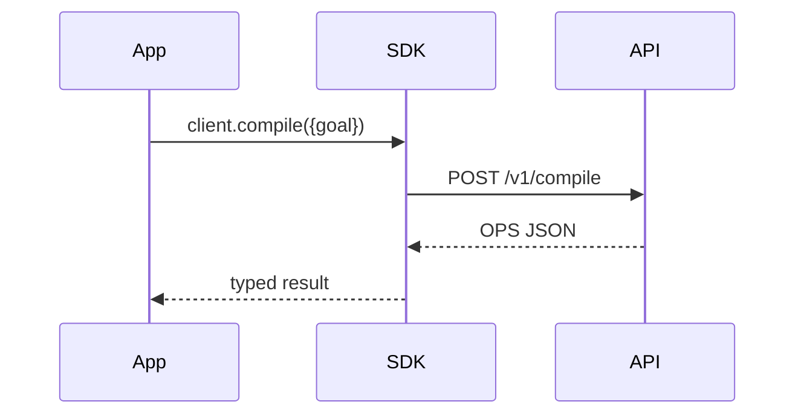

# TypeScript SDK
Typed client for web/node agents with OpenAPI-generated types.

---

## 💡 Purpose
- First-class DX for JS/TS ecosystems

## 🔁 Functional Flow (high level)

## 📥 Inputs
- API key, payloads

## 📤 Outputs
- typed results; `traceId` header surfaced

## 🔌 API (REST/gRPC) — Contract Snapshot
fetch/axios implementation w/ retries

## 🧠 Agent Integration Notes
- Works with Next.js/Node; ESM/CJS builds

## 🧪 Example
import { Dyo } from '@dyocense/sdk'; await new Dyo().optimise(ops);

## 🧱 Configuration
- `API_BASE`, `API_KEY`

## 🚨 Errors & Fallbacks
- **CORS**: configure gateway
- **429**: backoff

## 📊 Telemetry & Events
- OpenTelemetry spans: sdk.request
- CloudEvents: N/A

## 💻 Local Dev
- `pnpm -F sdk-typescript dev`

## ✅ Test Checklist
- [ ] Unit tests for happy path
- [ ] Schema validation errors
- [ ] Timeout + retry behavior
- [ ] OTel traces present
- [ ] CloudEvents emitted
