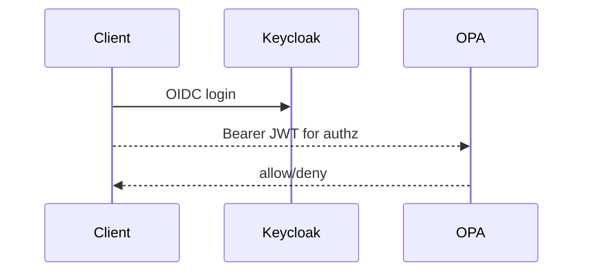

# Security & Policy (Keycloak, SPIFFE/SPIRE, OPA, Kyverno)
End-to-end zero-trust controls for users and workloads.

---

## 💡 Purpose
- Strong identity, fine-grained policy, signed supply chain

## 🔁 Functional Flow (high level)

## 📥 Inputs
- JWT, SPIFFE IDs, Rego policies

## 📤 Outputs
- allow/deny decisions, audit logs

## 🔌 API (REST/gRPC) — Contract Snapshot
OIDC discovery, Envoy ext_authz → OPA

## 🧠 Agent Integration Notes
- PATs for dev; rotate regularly

## 🧪 Example
opa eval -i input.json -d policy.rego 'data.api.allow'

## 🧱 Configuration
- `JWT_ISSUER`, `SPIRE_SERVER`, `POLICY_REPO`

## 🚨 Errors & Fallbacks
- **Clock skew**: JWT invalid
- **Policy deny**: include reason codes

## 📊 Telemetry & Events
- OpenTelemetry spans: security.authn, security.authz
- CloudEvents: security.policy.decision

## 💻 Local Dev
- docker compose for keycloak + opa

## ✅ Test Checklist
- [ ] Unit tests for happy path
- [ ] Schema validation errors
- [ ] Timeout + retry behavior
- [ ] OTel traces present
- [ ] CloudEvents emitted
