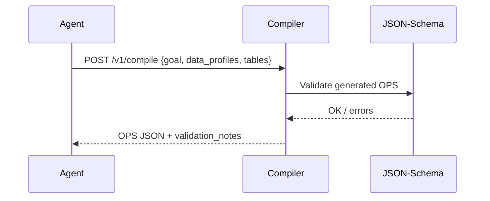

# Compiler Service (LLM → OPS)
Translates natural-language goals and table schemas into a valid **OPS JSON** (Optimization Problem Spec).

---

## 💡 Purpose
- Normalize user intent into a solver-ready problem spec
- Select archetype, fill defaults, emit validation notes

## 🔁 Functional Flow (high level)

## 📥 Inputs
- `goal: string`
- `data_profiles: object` (table names, fields, units)
- `tables: array<object>` (optional sample rows)

## 📤 Outputs
- `OPS JSON` (`ops.v1`) with: objective, variables, parameters, constraints, kpis
- `validation_notes[]`

## 🔌 API (REST/gRPC) — Contract Snapshot
POST /v1/compile → 200 OPS JSON (see contracts/schemas/ops.schema.json)

## 🧠 Agent Integration Notes
- MCP Tool: `compile`
- OpenAI Tool: `decision_kernel.compile`
- LangGraph: `CompileNode` produces `state['ops']`

## 🧪 Example
curl -X POST $API/v1/compile -H 'Authorization: Bearer ...' -d '{"goal":"Build rota under £5k","data_profiles":{}}'

## 🧱 Configuration
- `MODEL_PROVIDER` (vllm|ollama|openai)
- `MODEL_NAME`
- `TIMEOUT_COMPILE_MS` (default 10000)

## 🚨 Errors & Fallbacks
- **Invalid OPS**: returns 422 with `issues[]`
- **LLM failure**: retry once, then return 502 with `repair_suggestions`
- **Guardrails**: caps on variables/constraints

## 📊 Telemetry & Events
- OpenTelemetry spans: compiler.compile, compiler.validate
- CloudEvents: decision.compile.started, decision.compile.completed, decision.compile.failed

## 💻 Local Dev
- `uvicorn services.compiler.app:app --reload`
- `make dev-compiler`

## ✅ Test Checklist
- [ ] Unit tests for happy path
- [ ] Schema validation errors
- [ ] Timeout + retry behavior
- [ ] OTel traces present
- [ ] CloudEvents emitted
