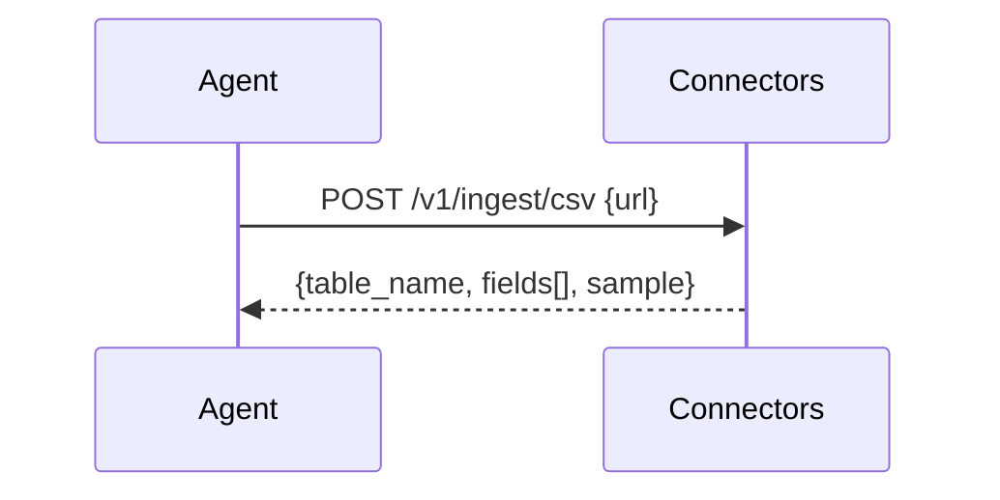

# Connectors Service
Normalizes external data sources (CSV/Sheets initially) into tables usable by the Compiler & Optimiser.

---

## 💡 Purpose
- Fast, zero-cost ingestion for SMEs and devs

## 🔁 Functional Flow (high level)

## 📥 Inputs
- CSV/Sheets URL, OAuth creds (where applicable)

## 📤 Outputs
- Normalized table schema + sample rows

## 🔌 API (REST/gRPC) — Contract Snapshot
POST /v1/ingest/csv, /v1/ingest/sheets

## 🧠 Agent Integration Notes
- Provide `data_profiles` to Compiler from here

## 🧪 Example
curl -X POST $API/v1/ingest/csv -d '{"url":"https://.../sales.csv"}'

## 🧱 Configuration
- `MAX_ROWS_PREVIEW`
- `ALLOWED_HOSTS`

## 🚨 Errors & Fallbacks
- **Unreachable URL**: 502
- **Parsing error**: 400 with column suggestions

## 📊 Telemetry & Events
- OpenTelemetry spans: connectors.ingest
- CloudEvents: decision.ingest.completed

## 💻 Local Dev
- `uvicorn services.connectors.app:app --reload`

## ✅ Test Checklist
- [ ] Unit tests for happy path
- [ ] Schema validation errors
- [ ] Timeout + retry behavior
- [ ] OTel traces present
- [ ] CloudEvents emitted
