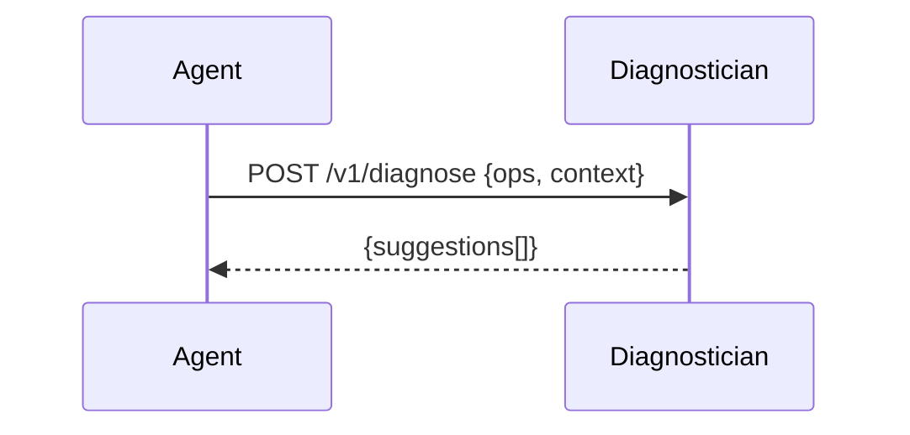

# Diagnostician Service (Infeasibility & Relaxations)
Analyzes infeasible models and proposes minimal, policy-aware relaxations.

---

## 💡 Purpose
- Help users reach feasibility quickly without trial-and-error

## 🔁 Functional Flow (high level)

## 📥 Inputs
- `ops` (failed instance)
- `context` (logs, constraints slacks if available)

## 📤 Outputs
- `suggestions[]` ordered by impact/policy cost

## 🔌 API (REST/gRPC) — Contract Snapshot
POST /v1/diagnose → 200 {suggestions[]}

## 🧠 Agent Integration Notes
- Tool: `diagnose`; pair with `optimise` retry loop

## 🧪 Example
curl -X POST $API/v1/diagnose -d '{"ops":{...}}'

## 🧱 Configuration
- `DIAG_MAX_SUGGESTIONS`
- `POLICY_ENFORCE_STRICT`

## 🚨 Errors & Fallbacks
- **Missing context**: 400
- **Policy conflict**: suggestions flagged with `requires_approval`

## 📊 Telemetry & Events
- OpenTelemetry spans: diagnose.run
- CloudEvents: decision.diagnose.started, decision.diagnose.completed

## 💻 Local Dev
- `uvicorn services.diagnostician.app:app --reload`

## ✅ Test Checklist
- [ ] Unit tests for happy path
- [ ] Schema validation errors
- [ ] Timeout + retry behavior
- [ ] OTel traces present
- [ ] CloudEvents emitted
