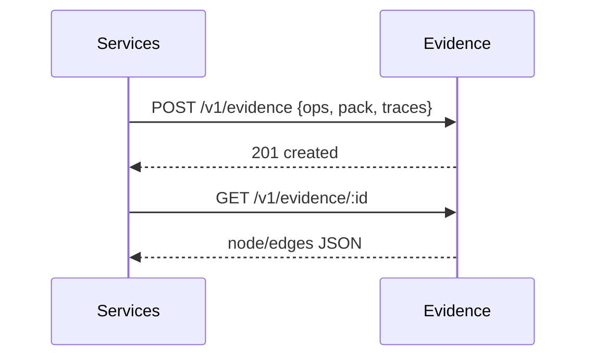

# Evidence Graph Service
Stores plan lineage: inputs → OPS → SolutionPack → explanation → outcomes; enables audits & learning.

---

## 💡 Purpose
- Provide traceable, explainable decision history
- Power KPI dashboards and model improvement

## 🔁 Functional Flow (high level)

## 📥 Inputs
- `ops`, `pack`, `otel_trace_id`, `artifacts` refs

## 📤 Outputs
- Graph node/edge ids; query API for lineage & KPIs

## 🔌 API (REST/gRPC) — Contract Snapshot
POST /v1/evidence, GET /v1/evidence/:id

## 🧠 Agent Integration Notes
- Agents can fetch summaries to ground future runs

## 🧪 Example
curl -X POST $API/v1/evidence -d '{"ops_ref":"s3://...","pack_ref":"s3://..."}'

## 🧱 Configuration
- `GRAPH_BACKEND` (janusgraph|neo4j)
- `RETENTION_DAYS`

## 🚨 Errors & Fallbacks
- **Missing refs**: 400
- **Too large payload**: 413 with S3 pre-signed URL flow

## 📊 Telemetry & Events
- OpenTelemetry spans: evidence.write, evidence.query
- CloudEvents: decision.evidence.created

## 💻 Local Dev
- `uvicorn services.evidence.app:app --reload`

## ✅ Test Checklist
- [ ] Unit tests for happy path
- [ ] Schema validation errors
- [ ] Timeout + retry behavior
- [ ] OTel traces present
- [ ] CloudEvents emitted
