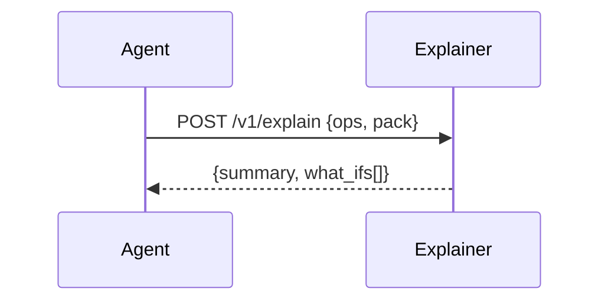

# Explainer Service
Generates natural-language rationales, trade-offs, and what-ifs from OPS + SolutionPack.

---

## 💡 Purpose
- Build trust with clear, concise explanations
- Suggest sensitivity levers for scenario analysis

## 🔁 Functional Flow (high level)

## 📥 Inputs
- `ops`, `pack`

## 📤 Outputs
- `summary: string`, `what_ifs: string[]`

## 🔌 API (REST/gRPC) — Contract Snapshot
POST /v1/explain → 200 Explanation JSON

## 🧠 Agent Integration Notes
- Tool: `explain` for post-solve
- MCP stream-friendly (partial deltas)

## 🧪 Example
curl -X POST $API/v1/explain -d '{"ops":{...},"pack":{...}}'

## 🧱 Configuration
- `MODEL_PROVIDER` (vllm|ollama|openai)
- `TIMEOUT_EXPLAIN_MS`

## 🚨 Errors & Fallbacks
- **Redaction**: removes PII fields
- **LLM timeout**: retry once, fallback to template-based summary

## 📊 Telemetry & Events
- OpenTelemetry spans: explainer.run
- CloudEvents: decision.explain.started, decision.explain.completed, decision.explain.failed

## 💻 Local Dev
- `uvicorn services.explainer.app:app --reload`

## ✅ Test Checklist
- [ ] Unit tests for happy path
- [ ] Schema validation errors
- [ ] Timeout + retry behavior
- [ ] OTel traces present
- [ ] CloudEvents emitted
