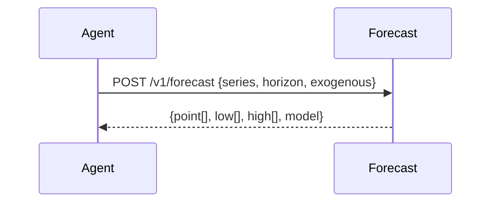

# Forecast Service
Provides demand/time-series forecasts with intervals and model metadata.

---

## 💡 Purpose
- Predict demand/cost/workload horizons
- Provide uncertainty bounds for downstream optimisation

## 🔁 Functional Flow (high level)

## 📥 Inputs
- `series: number[]`
- `horizon: int`
- `exogenous: object` (optional)

## 📤 Outputs
- `point[]`, `low[]`, `high[]`, `model`

## 🔌 API (REST/gRPC) — Contract Snapshot
POST /v1/forecast → 200 ForecastResult JSON

## 🧠 Agent Integration Notes
- Tool: `forecast` exposed for what-if planning
- Inject output into OPS parameters (e.g., `d[t,i]`)

## 🧪 Example
curl -X POST $API/v1/forecast -d '{"series":[10,11,9,13],"horizon":7}'

## 🧱 Configuration
- `FORECAST_BACKEND` (darts|prophet|sktime)
- `FORECAST_MAX_HORIZON`

## 🚨 Errors & Fallbacks
- **Short series**: 400 with guidance to aggregate
- **Model failure**: fallback to naive seasonal
- **Horizon too large**: 413

## 📊 Telemetry & Events
- OpenTelemetry spans: forecast.run
- CloudEvents: decision.forecast.started, decision.forecast.completed, decision.forecast.failed

## 💻 Local Dev
- `uvicorn services.forecast.app:app --reload`

## ✅ Test Checklist
- [ ] Unit tests for happy path
- [ ] Schema validation errors
- [ ] Timeout + retry behavior
- [ ] OTel traces present
- [ ] CloudEvents emitted
