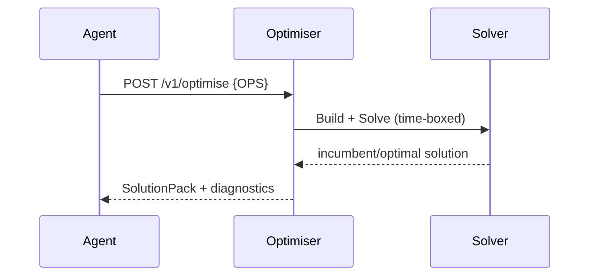

# Optimiser Service (OR)
Solves an **OPS** instance using OR-Tools/Pyomo/HiGHS and returns a **SolutionPack**.

---

## 💡 Purpose
- Enforce constraints and objective rigorously
- Return optimal/feasible plans with diagnostics

## 🔁 Functional Flow (high level)

## 📥 Inputs
- `OPS JSON` (validated)
- `time_limit_s` (optional query param)

## 📤 Outputs
- `SolutionPack` with `decisions`, `kpis`, `diagnostics{gap,runtime_ms,solver}`

## 🔌 API (REST/gRPC) — Contract Snapshot
POST /v1/optimise → 200 SolutionPack JSON (contracts/schemas/solutionpack.schema.json)

## 🧠 Agent Integration Notes
- Tool: `optimise` for agents
- LangGraph `SolveNode`: consumes `state['ops']`, produces `state['pack']`

## 🧪 Example
curl -X POST $API/v1/optimise -d @examples/inventory_simple.json

## 🧱 Configuration
- `SOLVER_BACKEND` (ortools|pyomo-highs)
- `SOLVER_TIME_LIMIT_S`
- `SOLVER_THREADS`

## 🚨 Errors & Fallbacks
- **Infeasible**: 409 with pointer to `/v1/diagnose`
- **Timeout**: 206 partial (best incumbent)
- **Unsafe expression**: 400 (parser rejects)

## 📊 Telemetry & Events
- OpenTelemetry spans: optimiser.validate, optimiser.build, optimiser.solve
- CloudEvents: decision.optimise.started, decision.optimise.completed, decision.optimise.timeout, decision.optimise.infeasible

## 💻 Local Dev
- `uvicorn services.optimiser.app:app --reload`

## ✅ Test Checklist
- [ ] Unit tests for happy path
- [ ] Schema validation errors
- [ ] Timeout + retry behavior
- [ ] OTel traces present
- [ ] CloudEvents emitted
