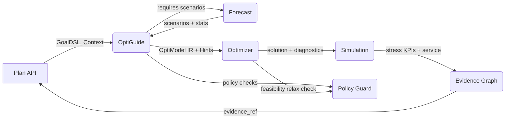
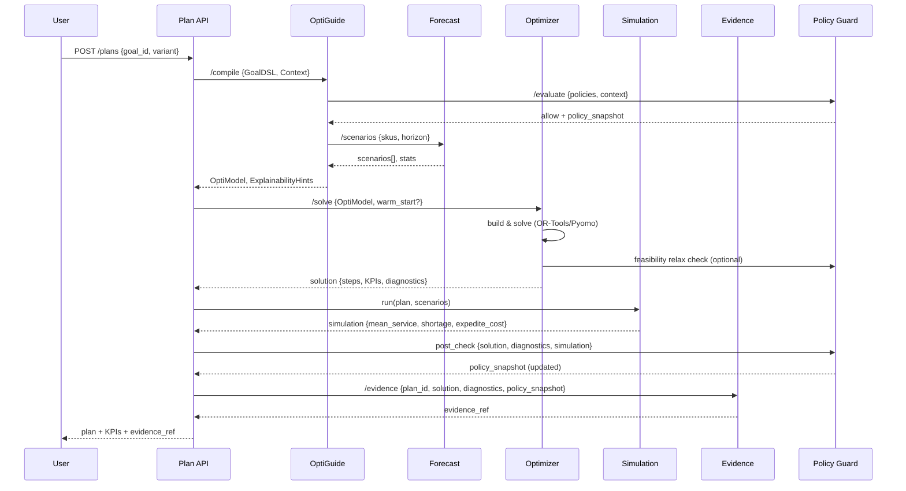
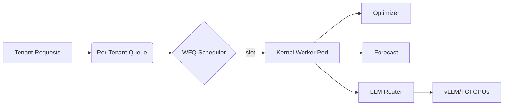
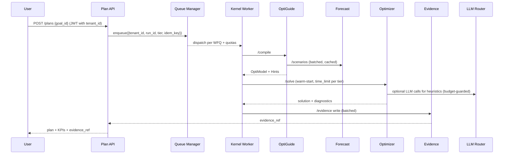

# Kernel — End-to-End DESIGN

> How the Dyocense **Decision Kernel** (Forecast → OptiGuide → Optimizer → Evidence) works as a single pipeline, including policies, configs, contracts, telemetry, and failure modes.

## 0) Scope

Covers the four kernel modules and their contracts with API layer & policy engine:

- **Forecast** → scenarios & stats
- **OptiGuide** → compile GoalDSL + context + scenarios → OptiModel IR + Explainability Hints
- **Optimizer** → solve IR → solution + diagnostics
- **Evidence Graph** → persist provenance, KPIs & sensitivities
- **Policy Guard (OPA)** → allow/deny, caps, vendor rules (consulted by OptiGuide/Optimizer)

---

## 1) High-level Flow



### Narrative

1. **Plan API** hands GoalDSL + planning context to **OptiGuide**.
2. OptiGuide requests **Forecast** scenarios (demand/lead-time), evaluates **Policy Guard**, and compiles the model.
3. **Optimizer** solves the IR with warm-starts and returns solution + core diagnostics.
4. **Simulation Service** stress-tests the plan and produces service/shortage metrics.
5. **Evidence Graph** records constraints, duals/activities, policy snapshot, simulation summary, scenario IDs, KPIs; returns `evidence_ref`.

---

## 2) End-to-End Sequence



---

## 3) Contracts (Schemas — excerpts)

### 3.1 `/forecast/scenarios` → `ScenarioSet`

```json
{
  "horizon": 4,
  "num_scenarios": 50,
  "skus": ["MILK-1L"],
  "scenarios": [
    {"id": 0, "demand": {"t1": 120, "t2": 110}, "lead_time_days": 2},
    {"id": 1, "demand": {"t1": 95,  "t2": 140}, "lead_time_days": 3}
  ],
  "stats": {"MILK-1L": {"mean": 115.2, "sigma": 18.5, "p95": 143}}
}
```

### 3.2 `/optiguide/compile` → `OptiModel` + `ExplainabilityHints`

```json
{
  "optimodel": {
    "vars": {"x[sku,supplier,period,scenario]": {"type":"int","lb":0}},
    "obj": {"sense": "min", "terms": [{"name":"cost","expr":"sum(price*x)","weight":0.6}]},
    "constraints": [{"name":"budget","expr":"sum(price*x)<=8000"}],
    "robust": {"scenarios": 50, "aggregation":"p95"}
  },
  "hints": {"track": ["budget","moq","balance","lead_time"], "sensitivities": ["price","moq"]}
}
```

### 3.3 `/optimizer/solve` → `SolutionEnvelope`

```json
{
"solution": {
  "status": "FEASIBLE",
  "gap": 0.012,
  "kpis": {"total_cost": 7821.4, "service": 0.975, "co2": 123.5},
  "steps": [
    {"sku":"MILK-1L","supplier":"S1","qty": 120,"price":0.79,"period":"t1"}
  ],
  "binding_constraints": ["budget","moq"],
  "activities": {"budget":8000,"balance_t2":0},
  "shadow_prices": {"budget": 0.03}
},
"diagnostics": {
  "reduction": {"original_count": 50, "reduced_count": 10},
  "robust_eval": {"worst_case_service": 0.91, "cvar_cost": 8120.0},
  "simulation": {"mean_service": 0.947, "avg_shortage": 3.2, "avg_expedite_cost": 88.4}
},
"policy": {
  "allow": true,
  "policy_id": "policy.guard.v1",
  "warnings": [],
  "controls": {"tier": "pro", "scenario_cap": 200}
}
}
```

### 3.4 `/evidence/write` → `EvidenceRef`

```json
{
  "evidence_ref":"neo4j://run/3f9a...",
  "snapshot_hash":"sha256:...",
  "policy_snapshot": {
    "policy_id": "policy.guard.v1",
    "allow": true,
    "warnings": [],
    "controls": {"tier": "pro", "scenario_cap": 200}
  }
}
```

---

## 4) Error & Recovery Paths

- **Infeasible model** → Optimizer runs IIS/relaxation; returns minimal relaxing slacks; Plan API surfaces *"which constraints to relax"*.
- **No/poor history** in Forecast → fall back to naive + wider σ; OptiGuide adds safety stock term.
- **Policy denial** → Policy Guard stops compile; returns `PolicySnapshot` with reasons + remediation (reduce scenarios, adjust budget).
- **Timeout** → return best‑found solution with `status=FEASIBLE` & `gap`.
- **Simulation fallback** → if simulation fails (no scenarios), diagnostics note `notes="No scenarios provided"` and pipeline continues with deterministic KPIs.

---

## 5) Configuration (defaults)

```json
{
  "forecast": {"num_scenarios": 50, "horizon": 4, "model":"auto"},
  "optimizer": {"time_limit_sec": 20, "mip_gap": 0.02, "threads": 0},
  "robust": {"aggregation": "p95"},
  "explainability": {"track": ["budget","moq","balance","lead_time"], "sensitivities": ["price","moq"]}
}
```

---

## 6) Telemetry & SLOs

- **Tracing (OTel spans):** `kernel.compile`, `kernel.forecast`, `kernel.solve`, `kernel.simulation`, `kernel.policy.guard`, `kernel.evidence.write`.
- **Metrics:** `solver_wall_time`, `mip_gap`, `status_code`, `forecast_rmse`, `scenario_count`, `robust_worst_service`, `simulation_mean_service`, `simulation_expedite_cost`, `policy_denials_total`, `policy_warnings_total`, `evidence_write_ms`.
- **SLOs:** P50 compile < 300ms; P50 solve < 20s; P95 end‑to‑end (forecast→evidence) < 90s; simulation add-on < 2s for 40 runs; policy evaluation < 50ms.

---

## 7) Governance & Safety Layer

- **PolicyGuardService (kernel/policy/service.py)** evaluates GoalDSL + context before solve and revisits the solution after optimization. It enforces tier-based caps (scenarios, budget), validates policy flags (vendor blocklists, deny overrides), and emits a structured `PolicySnapshot {allow, reasons, warnings, controls}` that travels with diagnostics and evidence metadata.
- **Pre-solve checks:** deny flag, scenario/budget quotas, supplier blocklist conflicts. Any violation raises a `PolicyDenied` error with remediation hints, preventing solver spend.
- **Post-solve checks:** compare delivered KPIs (cost, service) and robust metrics (`worst_case_service`) against recorded controls; downgrade `allow=false` when outputs violate caps, while retaining evidence for audit.
- **Safety logging:** all policy decisions tagged with `tenant_id`, `tier`, and `policy_id`. Counters (`policy_denials_total`, `policy_warnings_total`) feed alerts when a tenant approaches limits.
- **Security posture:** JWT tenant claims matched against request body; evidence metadata redacts PII and stores hashed references. Policy snapshots persisted alongside plan DNA to prove compliance during audits.

---

## 8) Test Strategy

- **Golden tests** for GoalDSL→OptiModel.
- **Scenario regression** for Optimizer across seed datasets.
- **Forecast backtests** with time‑series CV.
- **Policy guard** coverage: deny/warn scenarios, tier caps, post-solve guard rails.
- **Simulation diagnostics** sanity: service metrics stay within [0,1], expedite cost non-negative.
- **Property tests**: budget monotonicity (cost non‑decreasing as budget shrinks), feasibility under relaxations.

---

## 9) Hybrid Simulation–Optimization

After each solve the pipeline executes a **Monte Carlo execution simulation** to stress plans against sampled demand noise and lead-time variance. Key aspects:

- **Engine:** `SimulationService` (40 configurable runs, Gaussian noise scaled by forecast σ, expedite penalties).
- **Inputs:** `PlanningContext`, solved `Solution`, original `ScenarioSet`, compiled supplier prices.
- **Outputs:** `diagnostics.simulation` with `mean_service`, `p10_service`, `avg_shortage`, `avg_leftover`, and `avg_expedite_cost`.
- **Usage:**
  - Plan API surfaces the figures alongside deterministic KPIs.
  - Policy guard cross-checks `mean_service`/`worst_case_service` against contractual thresholds.
  - Evidence snapshots persist the summary for downstream BI dashboards and replay tooling.
- **Extensibility:** plug additional event hooks (e.g., discrete-event kitchen sim, logistics network replay) by swapping the `SimulationService` implementation while keeping the diagnostics contract intact.

Future extensions include exporting full sample traces (`top_worst_runs`) and scenario IDs to enable root-cause investigation.
---

## 10) Multi‑Tenancy & Scalability

This section extends the kernel to operate safely and efficiently across **many tenants** with different SLA tiers and budgets, while maintaining strict isolation and predictable costs.

### 10.1 Tenancy Primitives
- **Tenant ID**: carried end‑to‑end in JWT and traced in all spans/metrics/logs.
- **Run ID**: globally unique, idempotency‑keyed per request to avoid duplicate solves.
- **Tier**: `free | standard | pro | enterprise` (drives quotas, time limits, scenario caps).
- **Budget**: per‑tenant monthly compute budget (LLM tokens, GPU seconds, solver seconds).

```json
{
  "tenant_id": "tnt_7Gk...",
  "tier": "pro",
  "budgets": {"solver_sec": 12000, "gpu_sec": 6000, "llm_tokens": 1.5e9},
  "limits": {"scenarios_max": 200, "time_limit_sec": 45, "mip_gap_max": 0.03}
}
```

### 10.2 Data Partitioning & Isolation
- **MongoDB**: per-tenant collections or shared collections with `tenant_id` guard fields. Use helper utilities to append tenant filters to every query.
- **MinIO**: bucket or prefix per tenant: `minio://dyocense/{tenant_id}/evidence/...`.
- **Neo4j**: label or subgraph per tenant: `(:Goal {tenant_id})`, or use **multi‑DB** when scaling.
- **Redis**: namespaced keys: `tn:{tenant_id}:queue`, `tn:{tenant_id}:cache:*`.
- **Chroma/Qdrant**: collection per tenant (`collection_{tenant_id}`) with API tokens scoped per collection.

### 10.3 Compute Isolation & Fairness
- **Work Queues**: per‑tenant queues with **weighted fair‑queuing** (WFQ). 
- **Concurrency Limits**: `max_parallel_solves` per tenant; global pool per tier.
- **Sandboxing**: each solve runs in a short‑lived container/pod with cgroups CPU/memory limits.
- **GPU Scheduling**: vLLM/TGI served behind a router that enforces **GPU‑seconds per tenant** and **token budgets** (LiteLLM policies).



### 10.4 Rate‑Limiting, Quotas & Budgets
- Per‑tenant **rate limits** on `/compile`, `/solve`, `/scenarios` endpoints.
- Budgets decremented on usage; **hard stops** when budgets exhausted; soft alerts at 80%.
- **SLA tiers** map to solver time limits, scenario caps, retry policies.

```json
{
  "router_policies": {
    "tenant_id": "tnt_7Gk",
    "models": {"llama3:8b": {"max_tpm": 120000, "max_rpm": 60}},
    "fallbacks": ["mixtral:8x7b", "gpt-4o-mini"],
    "budget_tokens": 5.0e8
  }
}
```

### 10.5 Forecast & Scenario Scaling
- **Batching**: micro‑batch scenario requests for many SKUs of the same tenant/horizon.
- **Scenario Reduction**: k‑medoids or forward selection to reduce to N representative scenarios.
- **Caching**: content‑hash of `(sku, horizon, features, model_cfg)` → reuse across runs.
- **Async Mode**: if scenario generation exceeds SLO, return **202 + run handle**, notify when ready.

### 10.6 Optimizer Scaling
- **Incremental Re‑solve**: detect small diffs in inputs → warm‑start + partial re‑solve.
- **Decomposition**: split by category/location when weakly coupled; merge results with reconciliation constraints.
- **Parallelism**: run disjoint sub‑models concurrently within tenant quota; use CP‑SAT parallel workers with `num_search_workers` tuned per tier.
- **Scenario Aggregation**: solve on reduced set, then **stress‑test** best solution over full set to compute risk KPIs.

### 10.7 Evidence Graph at Scale
- **Write‑behind**: buffer evidence writes; batch upserts to Neo4j.
- **Sharding**: per‑tenant DBs or intra‑graph sharding by time window (e.g., month).
- **Snapshot GC**: MinIO lifecycle rules: retain last N snapshots per plan; archive older to cold storage.
- **Privacy**: hash/PBKDF for any PII; never store raw emails/phone; store pointers to secure vault if needed.

### 10.8 Idempotency & Reproducibility
- Every **/compile** and **/solve** call requires `Idempotency-Key` and **fixed random seed** per run.
- Persist **Model Fingerprint** (SHA‑256 of OptiModel JSON minus solver metadata) and **Plan DNA** (features hash). Use to dedupe identical solves.
- Record **versions**: OptiGuide, solver build, forecast config, scenario seed → full reproducibility.

```json
{
  "run_meta": {
    "idempotency_key": "idem_1a2b...",
    "seed": 424242,
    "optiguide_ver": "1.3.1h",
    "solver_ver": "ortools-9.10",
    "forecast_cfg": {"model": "auto", "num_scenarios": 50}
  },
  "fingerprints": {
    "optimodel_sha": "sha256:...",
    "plan_dna": "sha256:..."
  }
}
```

### 10.9 Telemetry Per Tenant
- Metrics tagged with `tenant_id`, `tier`, `goal_id` (cardinality bounded).
- Dashboards: **solver time vs budget**, **p95 solve latency**, **scenario cache hit rate**, **evidence write lag**.
- Alerts: budget exhaustion, abnormal infeasibility spike, drift in forecast error.

### 10.10 SLA Tiers (defaults)
| Tier | Max Scenarios | Solve Time Limit | Parallel Solves | GPU Access | Support |
|------|---------------|------------------|-----------------|-----------|---------|
| free | 20            | 15 s             | 1               | shared    | forum   |
| standard | 50        | 25 s             | 2               | shared    | email   |
| pro  | 100           | 45 s             | 4               | reserved  | 8×5     |
| enterprise | 200     | 90 s             | 8               | reserved  | 24×7    |

---

## 11) Multi‑Tenant Flow (Mermaid)


---

## 12) Uniqueness & Patentability Hooks
- **Plan DNA & Constraint Fingerprints**: deduplicate and compare plans across tenants without exposing sensitive data.
- **Evidence‑first Optimization**: constraints annotated with *intended effect* → automatic explanation templates.
- **Budget‑aware Model Router**: solver/LLM budgets jointly optimized per tenant (minimize cost subject to SLA).
- **Scenario‑then‑Stress** pipeline: reduced‑scenario solve + automated stress test → risk KPIs shown in Evidence.
- **Policy‑linted GoalDSL**: static + dynamic linting against OPA policies with human‑readable remediation.

---

## 13) Implementation Checklist
- [ ] Add `tenant_id`, `tier` to all kernel API contracts and tracing.
- [ ] Introduce Idempotency‑Key middleware and run seeds.
- [ ] Implement WFQ scheduler & per‑tenant concurrency in worker.
- [ ] Add scenario cache (content‑hash) and reduction step.
- [ ] Add warm‑start cache per `goal_id:variant`.
- [ ] Batch evidence writes and enable MinIO lifecycle rules.
- [ ] Tag all metrics with `tenant_id` + SLA tier; set alerts.

---

## 14) Kernel API — OpenAPI Excerpts (Multi‑tenant)

The kernel exposes four internal endpoints (behind API Gateway). All requests carry `tenant_id`, `tier`, and **Idempotency-Key**. JWT is required; scopes: `kernel.run`.

```yaml
openapi: 3.0.3
info: { title: Dyocense Kernel API, version: 1.0.0 }
paths:
  /forecast/scenarios:
    post:
      summary: Generate demand/lead-time scenarios
      operationId: forecastScenarios
      parameters:
        - in: header
          name: Idempotency-Key
          required: true
          schema: { type: string }
      requestBody:
        required: true
        content:
          application/json:
            schema:
              type: object
              required: [tenant_id, tier, skus, horizon, num_scenarios]
              properties:
                tenant_id: { type: string }
                tier: { type: string, enum: [free, standard, pro, enterprise] }
                skus: { type: array, items: { type: string } }
                horizon: { type: integer, minimum: 1 }
                num_scenarios: { type: integer, minimum: 1, maximum: 500 }
                model: { type: string, default: auto }
                seed: { type: integer, default: 424242 }
      responses:
        "200":
          description: Scenario set
          content:
            application/json:
              schema:
                $ref: '#/components/schemas/ScenarioSet'
  /optiguide/compile:
    post:
      summary: Compile GoalDSL to OptiModel IR
      operationId: optiguideCompile
      parameters:
        - in: header
          name: Idempotency-Key
          required: true
          schema: { type: string }
      requestBody:
        required: true
        content:
          application/json:
            schema:
              type: object
              required: [tenant_id, tier, goal_dsl, context, scenarios]
              properties:
                tenant_id: { type: string }
                tier: { type: string }
                goal_dsl: { type: object }
                context: { type: object }
                scenarios: { $ref: '#/components/schemas/ScenarioSet' }
                policy_snapshot: { type: object }
      responses:
        "200":
          description: OptiModel and hints
          content:
            application/json:
              schema:
                type: object
                properties:
                  optimodel: { $ref: '#/components/schemas/OptiModel' }
                  hints: { $ref: '#/components/schemas/ExplainabilityHints' }
  /optimizer/solve:
    post:
      summary: Solve OptiModel
      operationId: optimizerSolve
      parameters:
        - in: header
          name: Idempotency-Key
          required: true
          schema: { type: string }
      requestBody:
        required: true
        content:
          application/json:
            schema:
              type: object
              required: [tenant_id, tier, optimodel]
              properties:
                tenant_id: { type: string }
                tier: { type: string }
                optimodel: { $ref: '#/components/schemas/OptiModel' }
                warm_start: { type: object }
                seed: { type: integer }
                time_limit_sec: { type: integer, default: 20 }
                mip_gap: { type: number, default: 0.02 }
      responses:
        "200":
          description: Solution envelope
          content:
            application/json:
              schema:
                $ref: '#/components/schemas/SolutionEnvelope'
  /evidence/write:
    post:
      summary: Persist evidence graph & snapshot
      operationId: evidenceWrite
      parameters:
        - in: header
          name: Idempotency-Key
          required: true
          schema: { type: string }
      requestBody:
        required: true
        content:
          application/json:
            schema:
              type: object
              required: [tenant_id, plan_id, solution]
              properties:
                tenant_id: { type: string }
                plan_id: { type: string }
                solution: { $ref: '#/components/schemas/Solution' }
                constraints: { type: array, items: { type: object } }
                diagnostics: { type: object }
      responses:
        "200":
          description: Evidence reference
          content:
            application/json:
              schema:
                $ref: '#/components/schemas/EvidenceRef'
components:
  schemas:
    ScenarioSet:
      type: object
      properties:
        horizon: { type: integer }
        num_scenarios: { type: integer }
        skus: { type: array, items: { type: string } }
        scenarios:
          type: array
          items:
            type: object
            properties:
              id: { type: integer }
              demand: { type: object, additionalProperties: { type: number } }
              lead_time_days: { type: number }
        stats: { type: object, additionalProperties: { type: object } }
    OptiModel:
      type: object
      properties:
        vars: { type: object }
        obj: { type: object }
        constraints: { type: array, items: { type: object } }
        robust: { type: object }
    ExplainabilityHints:
      type: object
      properties:
        track: { type: array, items: { type: string } }
        sensitivities: { type: array, items: { type: string } }
    Solution:
      type: object
      properties:
        status: { type: string, enum: [OPTIMAL, FEASIBLE, INFEASIBLE, ERROR] }
        gap: { type: number }
        kpis: { type: object }
        steps:
          type: array
          items:
            type: object
            properties:
              sku: { type: string }
              supplier: { type: string }
              qty: { type: number }
              price: { type: number }
              period: { type: string }
        binding_constraints: { type: array, items: { type: string } }
        activities: { type: object }
        shadow_prices: { type: object }
    SolutionEnvelope:
      type: object
      properties:
        solution: { $ref: '#/components/schemas/Solution' }
        diagnostics:
          type: object
          properties:
            reduction: { type: object }
            robust_eval:
              type: object
              properties:
                worst_case_service: { type: number }
                cvar_cost: { type: number }
              additionalProperties: true
            simulation:
              type: object
              properties:
                runs: { type: integer }
                mean_service: { type: number }
                avg_shortage: { type: number }
                avg_expedite_cost: { type: number }
              additionalProperties: true
          additionalProperties: true
        policy: { $ref: '#/components/schemas/PolicySnapshot' }
      required: [solution]
    EvidenceRef:
      type: object
      properties:
        evidence_ref: { type: string }
        snapshot_hash: { type: string }
    PolicySnapshot:
      type: object
      properties:
        allow: { type: boolean }
        policy_id: { type: string }
        reasons: { type: array, items: { type: string } }
        warnings: { type: array, items: { type: string } }
        controls: { type: object, additionalProperties: true }
      required: [allow, policy_id]
```

---

## 15) Queue Manager — WFQ Policy

- Each request is enqueued as `{tenant_id, tier, run_id, cost_estimate}`.
- Scheduler applies **weighted fair‑queuing**: weights by tier, bounded by `max_parallel_solves` per tenant.
- Cost estimation formula:

```text
est_solver_sec = f(num_vars, num_constraints, scenarios) × coef_tier
est_gpu_sec    = token_count / tokens_per_sec(model)
est_llm_tokens = prompt_tokens + output_tokens
```

Requests exceeding remaining budget are **rejected** with 402 and guidance to upgrade or reduce scope (scenarios/time_limit).

---

## 16) Router Policy — Budget Enforcement (LiteLLM)

Example policy fragment for a tenant:
```json
{
  "tenant_id": "tnt_7Gk",
  "models": {
    "llama3:8b": { "max_tpm": 120000, "max_rpm": 60, "budget_tokens": 5.0e8 },
    "mixtral:8x7b": { "max_tpm": 60000, "max_rpm": 30 }
  },
  "fallbacks": ["mixtral:8x7b","gpt-4o-mini"]
}
```

---

## 17) Kernel Data Collections (MongoDB)

```json
{
  "_id": "run_123",
  "tenant_id": "tenant_demo",
  "tier": "pro",
  "idempotency_key": "idem_abc",
  "seed": 4242,
  "status": "FEASIBLE",
  "optimodel_sha": "sha256:...",
  "plan_dna": "sha256:...",
  "created_at": "2025-01-01T12:34:56Z"
}

{
  "tenant_id": "tenant_demo",
  "sku": "SKU1",
  "horizon": 4,
  "hash": "sha256:...",
  "model_cfg": {"num_scenarios": 50, "model": "auto"},
  "scenarios": [...],
  "stats": {...},
  "created_at": "2025-01-01T12:10:00Z"
}
```

---

## 18) Security Notes
- Every endpoint enforces `tenant_id` from JWT; body `tenant_id` must match.
- Evidence snapshots redact PII; store only hashes and pointers for sensitive artifacts.

---

## 19) Functional Use Cases (Cross‑Industry) — With Acceptance Criteria & API Examples

The kernel use cases below apply across retail, manufacturing, healthcare, logistics, hospitality, and services. Each includes **Acceptance Criteria (AC)** and **sample API calls** bound to our multi‑tenant contracts.

### UC‑KER‑001 — Goal → Plan (End‑to‑End)
**Actors:** User, Plan API, OptiGuide, Forecast, Optimizer, Evidence.  
**Preconditions:** `tenant_id` valid; SKU/supplier/price data present; policies loaded.  
**Flow:** GoalDSL → `/forecast/scenarios` → `/optiguide/compile` → `/optimizer/solve` → `/evidence/write` → return plan.

**AC:**
- AC‑1: Response includes `steps[]`, `kpis`, `evidence_ref`, `status ∈ {OPTIMAL, FEASIBLE}` within configured `time_limit_sec`.
- AC‑2: Replaying with same inputs + `seed` yields same KPIs ± solver tolerance.
- AC‑3: Binding constraints reported when `status ≠ INFEASIBLE`.

**Sample (curl)**
```bash
curl -X POST $KERNEL/forecast/scenarios \
  -H 'Authorization: Bearer $JWT' -H 'Idempotency-Key: idem_123' \
  -d '{"tenant_id":"t1","tier":"pro","skus":["MILK-1L"],"horizon":4,"num_scenarios":50}'

curl -X POST $KERNEL/optiguide/compile \
  -H 'Authorization: Bearer $JWT' -H 'Idempotency-Key: idem_124' \
  -d '{"tenant_id":"t1","tier":"pro","goal_dsl":{...},"context":{...},"scenarios":{...}}'

curl -X POST $KERNEL/optimizer/solve \
  -H 'Authorization: Bearer $JWT' -H 'Idempotency-Key: idem_125' \
  -d '{"tenant_id":"t1","tier":"pro","optimodel":{...},"time_limit_sec":20,"mip_gap":0.02}'

curl -X POST $KERNEL/evidence/write \
  -H 'Authorization: Bearer $JWT' -H 'Idempotency-Key: idem_126' \
  -d '{"tenant_id":"t1","plan_id":"p123","solution":{...}}'
```

---

### UC‑KER‑002 — Generate Forecast Scenarios
**Actors:** OptiGuide, Forecast.  
**AC:**
- AC‑1: For each SKU, returns `num_scenarios` within quota; includes `stats.mean, stats.sigma, stats.p95`.
- AC‑2: With insufficient history, falls back to naive model and widens σ; logs `model=fallback`.
- AC‑3: Cache hit ratio ≥ target when inputs unchanged (by hash).

**API:** `/forecast/scenarios` (POST) — see Section 14.

---

### UC‑KER‑003 — Compile GoalDSL → OptiModel (with Policies & Robustness)
**Actors:** OptiGuide, OPA.  
**AC:**
- AC‑1: Rejects models violating policies with remediation hints.  
- AC‑2: Supports `robust.mode ∈ {p95, dro_wasserstein, conformal}`.  
- AC‑3: Emits `ExplainabilityHints.track[]` for `budget, moq, balance, lead_time` by default.

**API:** `/optiguide/compile` (POST) — see Section 14.

---

### UC‑KER‑004 — Solve Optimization (Reduction + Stress + LNS)
**Actors:** Optimizer.  
**AC:**
- AC‑1: If `reduction.k` set, uses scenario reduction and reports reweighting.
- AC‑2: Returns `status`, `gap ≤ mip_gap`, KPIs, binding constraints.
- AC‑3: When `lns.iterations>0`, KPI improves ≥ threshold or early‑stop triggers.
- AC‑4: Stress test KPIs reported when full scenario set provided.

**API:** `/optimizer/solve` (POST).

---

### UC‑KER‑005 — Persist Evidence & Provenance
**Actors:** Evidence Graph.  
**AC:**
- AC‑1: Returns `evidence_ref` and `snapshot_hash` within SLA; write‑behind queue drains < threshold.
- AC‑2: Graph contains nodes: Goal, Constraint, Scenario, SolverRun, Plan, Step, KPI.
- AC‑3: If Evidence unavailable, request queued and plan marked `evidence_pending=true`.

**API:** `/evidence/write` (POST).

---

### UC‑KER‑006 — Multi‑Plan Variants (Cost / Balanced / Service)
**Actors:** Plan API, OptiGuide, Optimizer.  
**AC:**
- AC‑1: Produces three variants with objective mixes; deltas shown for cost/service/CO₂.
- AC‑2: Evidence links each variant to objective weights/ε‑constraints.

**Implementation Hint:** run `/optiguide/compile` and `/optimizer/solve` with different `objective_mode`.

---

### UC‑KER‑007 — What‑If / Delta‑Solve
**Actors:** User, Plan API, Optimizer.  
**AC:**
- AC‑1: Accepts param diffs (budget, MOQ, supplier set); re‑solves with warm start.
- AC‑2: Returns KPI deltas vs baseline; solve time ≤ `time_limit_delta` when change scope small.

**API:** `/optimizer/solve` with `warm_start` and delta config.

---

### UC‑KER‑008 — Infeasibility Diagnosis & Auto‑Relax
**Actors:** Optimizer, OptiGuide, Evidence.  
**AC:**
- AC‑1: Returns minimal relax set (elasticized constraints); plan becomes FEASIBLE after relax.
- AC‑2: Evidence records `RELAXED_BY` edges and remediation suggestions.

**API:** `/optimizer/solve` (response includes `diagnostics.relaxations`).

---

### UC‑KER‑009 — Multi‑Tenant Scheduling & Budgets
**Actors:** Queue Manager, Kernel workers, LLM Router.  
**AC:**
- AC‑1: WFQ ensures no tenant exceeds `max_parallel_solves`; rate limits enforced.
- AC‑2: Budgets (`solver_sec`, `gpu_sec`, `llm_tokens`) decremented; 402 on exhaustion with guidance.
- AC‑3: Per‑tenant dashboards show latency, usage vs budget.

**APIs:** Internal to queue/router; kernel APIs carry `tenant_id`, `tier`, `Idempotency-Key`.

---

### UC‑KER‑010 — Evidence Query & Explainability
**Actors:** Dashboard, Evidence.  
**AC:**
- AC‑1: “Why Supplier X?” query returns path from Step → Constraint/Objective → DataSource.
- AC‑2: Counterfactuals present: minimal changes to select an alternative supplier.

**Query Template:** See Evidence section (new edges/nodes for RiskKPI/FrontierPoint).

---

### UC‑KER‑011 — Feedback → Learning
**Actors:** Feedback API, Forecast, Evidence.  
**AC:**
- AC‑1: Actuals validate against Great Expectations; anomalies quarantined.
- AC‑2: Forecast residuals updated; supplier reliability score revised.
- AC‑3: Next run reflects updated priors; Evidence captures learning event.

---

## 20) Vertical Adaptation Patterns

| Domain | Additional Constraints | Objective Tweaks | Special Forecasting |
|---|---|---|---|
| Retail/Grocery | Shelf life, promo lifts | Waste penalty, price elasticity | Promotion calendar, holiday effects |
| Manufacturing | BOM, capacity, changeovers | Setup/min run costs | Intermittent spares; lead‑time reliability |
| Healthcare | Staff rostering, expiry | Service levels per shift | Appointment calendars, demand spikes |
| Logistics | Routing, truck capacity | CO₂ costs, time windows | Weather/traffic impacts |
| Hospitality | Menu cycles, prep labor | Freshness score | Day‑of‑week seasonality |

**Mechanism:** swap **context** + **GoalDSL** and reuse kernel. OptiGuide compiles domain constraints; Optimizer solves; Evidence explains trade‑offs.

---

## 21) Test Data Packs & Golden Runs
- **Small/Medium/Large** seeded datasets per domain; public synthetic versions for CI.
- Store golden `optimodel_sha`, `solution` KPIs; regression asserts ≤ tolerance.
- CLI utility: `dyocense-kernel replay --run RUN_ID` to reproduce and diff.

---

## 22) Production Readiness Checklist

| Area | Check | Status |
|---|---|---|
| Contracts | Schemas versioned (`GoalDSL`, `ScenarioSet`, `OptiModel`, `Solution`, `EvidenceRef`) | ☐ |
| Reproducibility | `seed`, `optimodel_sha`, `plan_dna` stored per run | ☐ |
| Multi‑tenant | WFQ, rate limits, budgets, quotas enforced | ☐ |
| Forecast | Backtests per SKU class; conformal intervals on | ☐ |
| Optimization | Scenario reduction default; LNS enabled for hot sets | ☐ |
| Evidence | Write‑behind + GC; PII redaction verified | ☐ |
| Security | JWT→tenant match; OPA snapshot logged; secrets via External Secrets | ☐ |
| Observability | OTel traces; Grafana dashboards; alerts configured | ☐ |
| DR/Backups | Mongo replica snapshots; MinIO replication; Neo4j dumps | ☐ |
| Runbooks | Infeasibility, policy denial, evidence backlog, queue saturation | ☐ |

---

## 23) Postman/HTTPie Collection (Outline)
- `forecast-scenarios.json` — POST `/forecast/scenarios` examples by tier.
- `optiguide-compile.json` — compile samples (weighted, ε‑constraint, DRO modes).
- `optimizer-solve.json` — base, reduced+stress, LNS, delta‑solve.
- `evidence-write.json` — complete write payload with constraints/diagnostics.

```
# httpie sample
http POST $KERNEL/optimizer/solve Authorization:"Bearer $JWT" Idempotency-Key:idem_999 \
  tenant_id=t1 tier=pro optimodel:='{"vars":{},"obj":{},"constraints":[]}' time_limit_sec:=20 mip_gap:=0.02
```

---

## 24) Domain Adaptation Guide

The Dyocense kernel is **industry-agnostic at its core**. Domain-specific behavior is injected via GoalDSL extensions, constraint templates, and forecasting features. This guide shows how to adapt it to new business domains with minimal change.

### 24.1 Adaptation Dimensions
- **GoalDSL Extensions**: introduce new goal primitives relevant to the domain (e.g., `staff_utilization`, `shelf_life_days`, `truck_capacity`).
- **Constraint Libraries**: add domain constraint templates to OptiGuide (BOM, staff rostering, route time windows, cold-chain requirements).
- **Forecast Features**: enrich historical data with domain signals (holidays/promotions for retail, machine utilization for manufacturing, patient inflow for healthcare).
- **Objective Tweaks**: adjust KPI weights or add new objectives (waste, labor cost, CO₂, freshness, reliability).
- **Evidence Ontology**: extend graph schema with new node/edge types (e.g., `StaffShift`, `Machine`, `RouteSegment`).

### 24.2 Domain Plug-In Examples
- **Retail/Grocery**
  - GoalDSL: `waste <= 5%`, `service >= 0.97`.
  - Constraints: shelf life, promo lift factors.
  - Forecast: seasonality, holiday demand spikes.
  - Objectives: minimize spoilage cost.

- **Manufacturing**
  - GoalDSL: `lead_time <= 10d`, `co2 <= 500`.
  - Constraints: BOM dependencies, machine capacity, changeovers.
  - Forecast: intermittent spare parts demand, reliability of suppliers.
  - Objectives: minimize setup costs, balance utilization.

- **Healthcare**
  - GoalDSL: `staff_coverage >= 95%`, `expiry_waste <= 2%`.
  - Constraints: rostering rules, drug expiry, patient safety policies.
  - Forecast: patient inflows, seasonal illness patterns.
  - Objectives: maximize service levels, minimize overtime.

- **Logistics**
  - GoalDSL: `on_time >= 98%`, `co2 <= 300`.
  - Constraints: routing, vehicle capacity, time windows.
  - Forecast: traffic, weather impact.
  - Objectives: minimize CO₂ per mile, maximize load factor.

- **Hospitality**
  - GoalDSL: `menu_freshness >= 90%`.
  - Constraints: prep labor, menu cycles, supplier variability.
  - Forecast: day-of-week demand swings.
  - Objectives: balance cost, freshness, and labor efficiency.

### 24.3 Adaptation Workflow
1. **Model Context**: Extend GoalDSL schema for new primitives.
2. **Constraint Templates**: Add reusable constraints to OptiGuide.
3. **Forecast Feature Engineering**: Connect new data sources; adjust pipeline.
4. **Objective Functions**: Calibrate KPI weights or add new ones.
5. **Evidence Extensions**: Define new node/edge types; update query templates.
6. **Regression Tests**: Seed golden datasets per domain; validate end-to-end runs.

### 24.4 Reuse vs. Extend
- **Reuse**: Core compile/solve/evidence pipeline remains unchanged.
- **Extend**: Only domain-specific GoalDSL/constraints/forecast features need to be swapped.

**Result:** rapid onboarding of new industries without redesigning the kernel.
```

```
