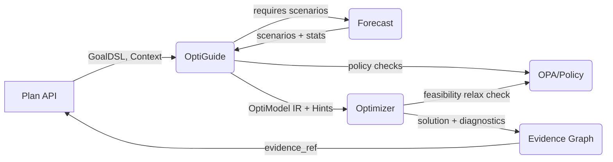
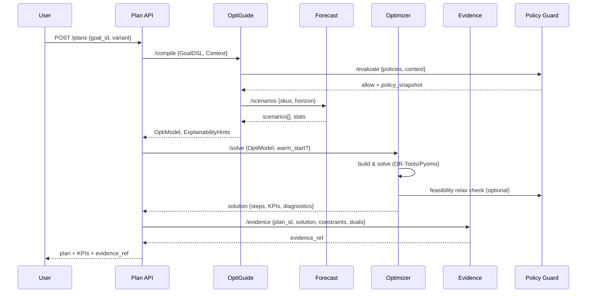
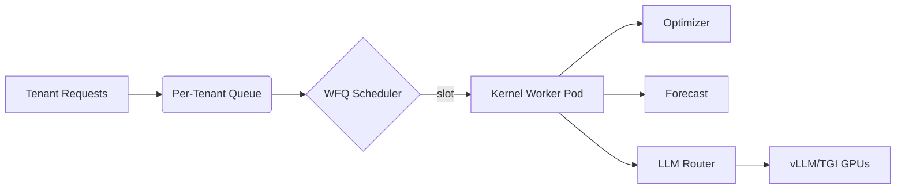
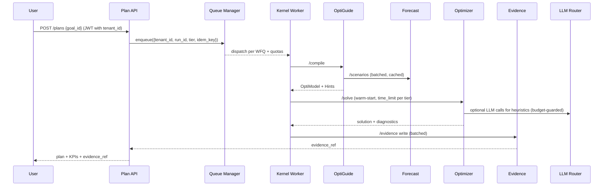

# Kernel — End-to-End DESIGN

> How the Dyocense **Decision Kernel** (Forecast → OptiGuide → Optimizer → Evidence) works as a single pipeline, including policies, configs, contracts, telemetry, and failure modes.

## 0) Scope

Covers the four kernel modules and their contracts with API layer & policy engine:

- **Forecast** → scenarios & stats
- **OptiGuide** → compile GoalDSL + context + scenarios → OptiModel IR + Explainability Hints
- **Optimizer** → solve IR → solution + diagnostics
- **Evidence Graph** → persist provenance, KPIs & sensitivities
- **Policy Guard (OPA)** → allow/deny, caps, vendor rules (consulted by OptiGuide/Optimizer)

---

## 1) High-level Flow



### Narrative

1. **Plan API** hands GoalDSL + planning context to **OptiGuide**.
2. OptiGuide requests **Forecast** scenarios (demand/lead-time) and compiles the model.
3. **Optimizer** solves the IR with warm-starts and returns solution + diagnostics.
4. **Evidence Graph** records constraints, duals/activities, scenario IDs, KPIs; returns `evidence_ref`.

---

## 2) End-to-End Sequence



---

## 3) Contracts (Schemas — excerpts)

### 3.1 `/forecast/scenarios` → `ScenarioSet`

```json
{
  "horizon": 4,
  "num_scenarios": 50,
  "skus": ["MILK-1L"],
  "scenarios": [
    {"id": 0, "demand": {"t1": 120, "t2": 110}, "lead_time_days": 2},
    {"id": 1, "demand": {"t1": 95,  "t2": 140}, "lead_time_days": 3}
  ],
  "stats": {"MILK-1L": {"mean": 115.2, "sigma": 18.5, "p95": 143}}
}
```

### 3.2 `/optiguide/compile` → `OptiModel` + `ExplainabilityHints`

```json
{
  "optimodel": {
    "vars": {"x[sku,supplier,period,scenario]": {"type":"int","lb":0}},
    "obj": {"sense": "min", "terms": [{"name":"cost","expr":"sum(price*x)","weight":0.6}]},
    "constraints": [{"name":"budget","expr":"sum(price*x)<=8000"}],
    "robust": {"scenarios": 50, "aggregation":"p95"}
  },
  "hints": {"track": ["budget","moq","balance","lead_time"], "sensitivities": ["price","moq"]}
}
```

### 3.3 `/optimizer/solve` → `Solution`

```json
{
  "status": "FEASIBLE",
  "gap": 0.012,
  "kpis": {"total_cost": 7821.4, "service": 0.975, "co2": 123.5},
  "steps": [
    {"sku":"MILK-1L","supplier":"S1","qty": 120,"price":0.79,"period":"t1"}
  ],
  "binding_constraints": ["budget","moq"],
  "activities": {"budget":8000,"balance_t2":0},
  "shadow_prices": {"budget": 0.03}
}
```

### 3.4 `/evidence/write` → `EvidenceRef`

```json
{"evidence_ref":"neo4j://run/3f9a...", "snapshot_hash":"sha256:..."}
```

---

## 4) Error & Recovery Paths

- **Infeasible model** → Optimizer runs IIS/relaxation; returns minimal relaxing slacks; Plan API surfaces *"which constraints to relax"*.
- **No/poor history** in Forecast → fall back to naive + wider σ; OptiGuide adds safety stock term.
- **Policy denial** → early fail from OptiGuide with human‑readable message & offending rule.
- **Timeout** → return best‑found solution with `status=FEASIBLE` & `gap`.

---

## 5) Configuration (defaults)

```json
{
  "forecast": {"num_scenarios": 50, "horizon": 4, "model":"auto"},
  "optimizer": {"time_limit_sec": 20, "mip_gap": 0.02, "threads": 0},
  "robust": {"aggregation": "p95"},
  "explainability": {"track": ["budget","moq","balance","lead_time"], "sensitivities": ["price","moq"]}
}
```

---

## 6) Telemetry & SLOs

- **Tracing (OTel spans):** `kernel.compile`, `kernel.forecast`, `kernel.solve`, `kernel.evidence.write`.
- **Metrics:** `solver_wall_time`, `mip_gap`, `status_code`, `forecast_rmse`, `scenario_count`, `evidence_write_ms`.
- **SLOs:** P50 compile < 300ms; P50 solve < 20s; P95 end‑to‑end < 90s.

---

## 7) Security & Policy Hooks

- JWT propagated with tenant; OptiGuide queries OPA for *vendor allow/deny*, *spend caps*.
- Evidence Graph redacts PII; snapshots hashed in MinIO.

---

## 8) Test Strategy

- **Golden tests** for GoalDSL→OptiModel.
- **Scenario regression** for Optimizer across seed datasets.
- **Forecast backtests** with time‑series CV.
- **Property tests**: budget monotonicity (cost non‑decreasing as budget shrinks), feasibility under relaxations.

---

## 9) Future Extensions


---

## 10) Multi‑Tenancy & Scalability

This section extends the kernel to operate safely and efficiently across **many tenants** with different SLA tiers and budgets, while maintaining strict isolation and predictable costs.

### 10.1 Tenancy Primitives
- **Tenant ID**: carried end‑to‑end in JWT and traced in all spans/metrics/logs.
- **Run ID**: globally unique, idempotency‑keyed per request to avoid duplicate solves.
- **Tier**: `free | standard | pro | enterprise` (drives quotas, time limits, scenario caps).
- **Budget**: per‑tenant monthly compute budget (LLM tokens, GPU seconds, solver seconds).

```json
{
  "tenant_id": "tnt_7Gk...",
  "tier": "pro",
  "budgets": {"solver_sec": 12000, "gpu_sec": 6000, "llm_tokens": 1.5e9},
  "limits": {"scenarios_max": 200, "time_limit_sec": 45, "mip_gap_max": 0.03}
}
```

### 10.2 Data Partitioning & Isolation
- **Postgres**: either (a) **schema‑per‑tenant** for small N tenants, or (b) **row‑level security (RLS)** with `tenant_id` column + policies. All queries **MUST** include tenant filters via DAO helpers.
- **MinIO**: bucket or prefix per tenant: `minio://dyocense/{tenant_id}/evidence/...`.
- **Neo4j**: label or subgraph per tenant: `(:Goal {tenant_id})`, or use **multi‑DB** when scaling.
- **Redis**: namespaced keys: `tn:{tenant_id}:queue`, `tn:{tenant_id}:cache:*`.
- **Chroma/Qdrant**: collection per tenant (`collection_{tenant_id}`) with API tokens scoped per collection.

### 10.3 Compute Isolation & Fairness
- **Work Queues**: per‑tenant queues with **weighted fair‑queuing** (WFQ). 
- **Concurrency Limits**: `max_parallel_solves` per tenant; global pool per tier.
- **Sandboxing**: each solve runs in a short‑lived container/pod with cgroups CPU/memory limits.
- **GPU Scheduling**: vLLM/TGI served behind a router that enforces **GPU‑seconds per tenant** and **token budgets** (LiteLLM policies).



### 10.4 Rate‑Limiting, Quotas & Budgets
- Per‑tenant **rate limits** on `/compile`, `/solve`, `/scenarios` endpoints.
- Budgets decremented on usage; **hard stops** when budgets exhausted; soft alerts at 80%.
- **SLA tiers** map to solver time limits, scenario caps, retry policies.

```json
{
  "router_policies": {
    "tenant_id": "tnt_7Gk",
    "models": {"llama3:8b": {"max_tpm": 120000, "max_rpm": 60}},
    "fallbacks": ["mixtral:8x7b", "gpt-4o-mini"],
    "budget_tokens": 5.0e8
  }
}
```

### 10.5 Forecast & Scenario Scaling
- **Batching**: micro‑batch scenario requests for many SKUs of the same tenant/horizon.
- **Scenario Reduction**: k‑medoids or forward selection to reduce to N representative scenarios.
- **Caching**: content‑hash of `(sku, horizon, features, model_cfg)` → reuse across runs.
- **Async Mode**: if scenario generation exceeds SLO, return **202 + run handle**, notify when ready.

### 10.6 Optimizer Scaling
- **Incremental Re‑solve**: detect small diffs in inputs → warm‑start + partial re‑solve.
- **Decomposition**: split by category/location when weakly coupled; merge results with reconciliation constraints.
- **Parallelism**: run disjoint sub‑models concurrently within tenant quota; use CP‑SAT parallel workers with `num_search_workers` tuned per tier.
- **Scenario Aggregation**: solve on reduced set, then **stress‑test** best solution over full set to compute risk KPIs.

### 10.7 Evidence Graph at Scale
- **Write‑behind**: buffer evidence writes; batch upserts to Neo4j.
- **Sharding**: per‑tenant DBs or intra‑graph sharding by time window (e.g., month).
- **Snapshot GC**: MinIO lifecycle rules: retain last N snapshots per plan; archive older to cold storage.
- **Privacy**: hash/PBKDF for any PII; never store raw emails/phone; store pointers to secure vault if needed.

### 10.8 Idempotency & Reproducibility
- Every **/compile** and **/solve** call requires `Idempotency-Key` and **fixed random seed** per run.
- Persist **Model Fingerprint** (SHA‑256 of OptiModel JSON minus solver metadata) and **Plan DNA** (features hash). Use to dedupe identical solves.
- Record **versions**: OptiGuide, solver build, forecast config, scenario seed → full reproducibility.

```json
{
  "run_meta": {
    "idempotency_key": "idem_1a2b...",
    "seed": 424242,
    "optiguide_ver": "1.3.1h",
    "solver_ver": "ortools-9.10",
    "forecast_cfg": {"model": "auto", "num_scenarios": 50}
  },
  "fingerprints": {
    "optimodel_sha": "sha256:...",
    "plan_dna": "sha256:..."
  }
}
```

### 10.9 Telemetry Per Tenant
- Metrics tagged with `tenant_id`, `tier`, `goal_id` (cardinality bounded).
- Dashboards: **solver time vs budget**, **p95 solve latency**, **scenario cache hit rate**, **evidence write lag**.
- Alerts: budget exhaustion, abnormal infeasibility spike, drift in forecast error.

### 10.10 SLA Tiers (defaults)
| Tier | Max Scenarios | Solve Time Limit | Parallel Solves | GPU Access | Support |
|------|---------------|------------------|-----------------|-----------|---------|
| free | 20            | 15 s             | 1               | shared    | forum   |
| standard | 50        | 25 s             | 2               | shared    | email   |
| pro  | 100           | 45 s             | 4               | reserved  | 8×5     |
| enterprise | 200     | 90 s             | 8               | reserved  | 24×7    |

---

## 11) Multi‑Tenant Flow (Mermaid)


---

## 12) Uniqueness & Patentability Hooks
- **Plan DNA & Constraint Fingerprints**: deduplicate and compare plans across tenants without exposing sensitive data.
- **Evidence‑first Optimization**: constraints annotated with *intended effect* → automatic explanation templates.
- **Budget‑aware Model Router**: solver/LLM budgets jointly optimized per tenant (minimize cost subject to SLA).
- **Scenario‑then‑Stress** pipeline: reduced‑scenario solve + automated stress test → risk KPIs shown in Evidence.
- **Policy‑linted GoalDSL**: static + dynamic linting against OPA policies with human‑readable remediation.

---

## 13) Implementation Checklist
- [ ] Add `tenant_id`, `tier` to all kernel API contracts and tracing.
- [ ] Introduce Idempotency‑Key middleware and run seeds.
- [ ] Implement WFQ scheduler & per‑tenant concurrency in worker.
- [ ] Add scenario cache (content‑hash) and reduction step.
- [ ] Add warm‑start cache per `goal_id:variant`.
- [ ] Batch evidence writes and enable MinIO lifecycle rules.
- [ ] Tag all metrics with `tenant_id` + SLA tier; set alerts.

---

## 14) Kernel API — OpenAPI Excerpts (Multi‑tenant)

The kernel exposes four internal endpoints (behind API Gateway). All requests carry `tenant_id`, `tier`, and **Idempotency-Key**. JWT is required; scopes: `kernel.run`.

```yaml
openapi: 3.0.3
info: { title: Dyocense Kernel API, version: 1.0.0 }
paths:
  /forecast/scenarios:
    post:
      summary: Generate demand/lead-time scenarios
      operationId: forecastScenarios
      parameters:
        - in: header
          name: Idempotency-Key
          required: true
          schema: { type: string }
      requestBody:
        required: true
        content:
          application/json:
            schema:
              type: object
              required: [tenant_id, tier, skus, horizon, num_scenarios]
              properties:
                tenant_id: { type: string }
                tier: { type: string, enum: [free, standard, pro, enterprise] }
                skus: { type: array, items: { type: string } }
                horizon: { type: integer, minimum: 1 }
                num_scenarios: { type: integer, minimum: 1, maximum: 500 }
                model: { type: string, default: auto }
                seed: { type: integer, default: 424242 }
      responses:
        "200":
          description: Scenario set
          content:
            application/json:
              schema:
                $ref: '#/components/schemas/ScenarioSet'
  /optiguide/compile:
    post:
      summary: Compile GoalDSL to OptiModel IR
      operationId: optiguideCompile
      parameters:
        - in: header
          name: Idempotency-Key
          required: true
          schema: { type: string }
      requestBody:
        required: true
        content:
          application/json:
            schema:
              type: object
              required: [tenant_id, tier, goal_dsl, context, scenarios]
              properties:
                tenant_id: { type: string }
                tier: { type: string }
                goal_dsl: { type: object }
                context: { type: object }
                scenarios: { $ref: '#/components/schemas/ScenarioSet' }
                policy_snapshot: { type: object }
      responses:
        "200":
          description: OptiModel and hints
          content:
            application/json:
              schema:
                type: object
                properties:
                  optimodel: { $ref: '#/components/schemas/OptiModel' }
                  hints: { $ref: '#/components/schemas/ExplainabilityHints' }
  /optimizer/solve:
    post:
      summary: Solve OptiModel
      operationId: optimizerSolve
      parameters:
        - in: header
          name: Idempotency-Key
          required: true
          schema: { type: string }
      requestBody:
        required: true
        content:
          application/json:
            schema:
              type: object
              required: [tenant_id, tier, optimodel]
              properties:
                tenant_id: { type: string }
                tier: { type: string }
                optimodel: { $ref: '#/components/schemas/OptiModel' }
                warm_start: { type: object }
                seed: { type: integer }
                time_limit_sec: { type: integer, default: 20 }
                mip_gap: { type: number, default: 0.02 }
      responses:
        "200":
          description: Solution
          content:
            application/json:
              schema:
                $ref: '#/components/schemas/Solution'
  /evidence/write:
    post:
      summary: Persist evidence graph & snapshot
      operationId: evidenceWrite
      parameters:
        - in: header
          name: Idempotency-Key
          required: true
          schema: { type: string }
      requestBody:
        required: true
        content:
          application/json:
            schema:
              type: object
              required: [tenant_id, plan_id, solution]
              properties:
                tenant_id: { type: string }
                plan_id: { type: string }
                solution: { $ref: '#/components/schemas/Solution' }
                constraints: { type: array, items: { type: object } }
                diagnostics: { type: object }
      responses:
        "200":
          description: Evidence reference
          content:
            application/json:
              schema:
                $ref: '#/components/schemas/EvidenceRef'
components:
  schemas:
    ScenarioSet:
      type: object
      properties:
        horizon: { type: integer }
        num_scenarios: { type: integer }
        skus: { type: array, items: { type: string } }
        scenarios:
          type: array
          items:
            type: object
            properties:
              id: { type: integer }
              demand: { type: object, additionalProperties: { type: number } }
              lead_time_days: { type: number }
        stats: { type: object, additionalProperties: { type: object } }
    OptiModel:
      type: object
      properties:
        vars: { type: object }
        obj: { type: object }
        constraints: { type: array, items: { type: object } }
        robust: { type: object }
    ExplainabilityHints:
      type: object
      properties:
        track: { type: array, items: { type: string } }
        sensitivities: { type: array, items: { type: string } }
    Solution:
      type: object
      properties:
        status: { type: string, enum: [OPTIMAL, FEASIBLE, INFEASIBLE, ERROR] }
        gap: { type: number }
        kpis: { type: object }
        steps:
          type: array
          items:
            type: object
            properties:
              sku: { type: string }
              supplier: { type: string }
              qty: { type: number }
              price: { type: number }
              period: { type: string }
        binding_constraints: { type: array, items: { type: string } }
        activities: { type: object }
        shadow_prices: { type: object }
    EvidenceRef:
      type: object
      properties:
        evidence_ref: { type: string }
        snapshot_hash: { type: string }
```

---

## 15) Queue Manager — WFQ Policy

- Each request is enqueued as `{tenant_id, tier, run_id, cost_estimate}`.
- Scheduler applies **weighted fair‑queuing**: weights by tier, bounded by `max_parallel_solves` per tenant.
- Cost estimation formula:

```text
est_solver_sec = f(num_vars, num_constraints, scenarios) × coef_tier
est_gpu_sec    = token_count / tokens_per_sec(model)
est_llm_tokens = prompt_tokens + output_tokens
```

Requests exceeding remaining budget are **rejected** with 402 and guidance to upgrade or reduce scope (scenarios/time_limit).

---

## 16) Router Policy — Budget Enforcement (LiteLLM)

Example policy fragment for a tenant:
```json
{
  "tenant_id": "tnt_7Gk",
  "models": {
    "llama3:8b": { "max_tpm": 120000, "max_rpm": 60, "budget_tokens": 5.0e8 },
    "mixtral:8x7b": { "max_tpm": 60000, "max_rpm": 30 }
  },
  "fallbacks": ["mixtral:8x7b","gpt-4o-mini"]
}
```

---

## 17) Kernel Data Tables (Postgres/RLS)

```sql
-- All tables include tenant_id and RLS policies
CREATE TABLE kernel_runs (
  run_id text primary key,
  tenant_id text not null,
  tier text not null,
  idem_key text not null,
  seed int,
  started_at timestamptz default now(),
  status text,
  optimodel_sha text,
  plan_dna text
);

CREATE TABLE forecast_cache (
  tenant_id text,
  sku text,
  horizon int,
  model_cfg jsonb,
  scenarios jsonb,
  stats jsonb,
  hash text,
  created_at timestamptz default now(),
  primary key (tenant_id, sku, horizon, hash)
);
```

---

## 18) Security Notes
- Every endpoint enforces `tenant_id` from JWT; body `tenant_id` must match.
- Evidence snapshots redact PII; store only hashes and pointers for sensitive artifacts.
