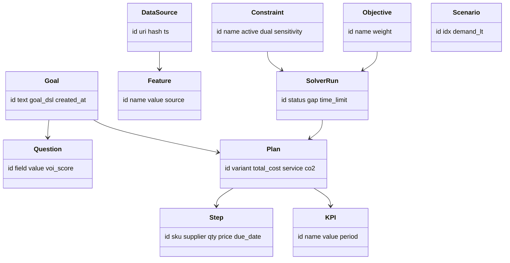
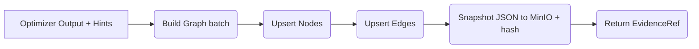
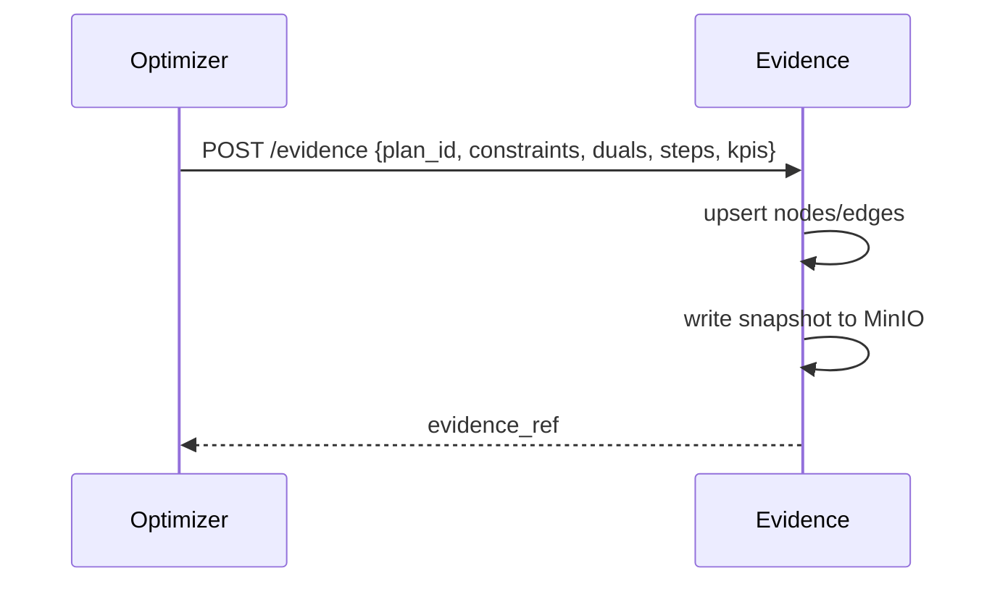

# Evidence Graph — DESIGN (Detailed)

Stores provenance for every plan decision: *what data, constraints, and trade‑offs produced which steps*. Implemented in **Neo4j** with snapshots (JSON + hash) in **MinIO**.

---

## 1) Node & Edge Schema
- **Nodes**: `Goal`, `Question`, `DataSource`, `Feature`, `Constraint`, `Objective`, `Scenario`, `SolverRun`, `Plan`, `Step`, `KPI`.
- **Edges**: `DERIVED_FROM`, `CONSTRAINS`, `OPTIMIZES`, `SUPPORTS`, `MEASURED_BY`, `EXECUTED_AS`.

## 2) Write Flow

## 3) Sequence (after solve)

## 4) Query Patterns
- “Why vendor X?” → follow `Step -> DERIVED_FROM (Constraint, Objective, Data)`
- “Which constraints bound?” → filter `Constraint.active=true` on `SolverRun`

## 5) Retention & Privacy
- Hash PII in snapshots; redact logs; TTL for raw artifacts; keep graph structure for audit.
