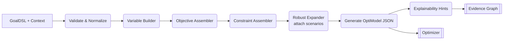
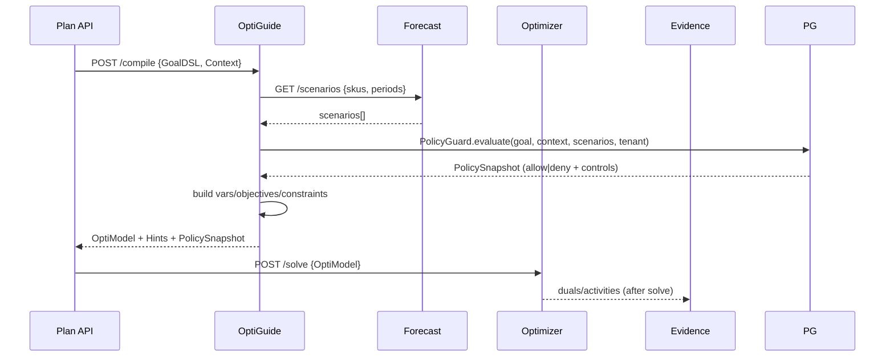

# OptiGuide — DESIGN (Detailed)

OptiGuide is a **declarative compiler** that transforms `GoalDSL` into a solver‑ready mathematical program. It assembles objectives, constraints, variables, and bounds, consults the **Policy Guard** for governance checks, emits a normalized model (JSON) for the Optimizer, and produces **Explainability Hints** (constraint activity, duals request) plus a `PolicySnapshot` consumed by the pipeline & Evidence Graph.

---

## 1) Responsibilities
- Parse & validate `GoalDSL` (JSON Schema).
- Build decision variables (order qty, supplier choice, inventory, slack).
- Compile **objectives** (cost, service, CO₂, risk) with weights.
- Compile **constraints** (budget, MOQ, capacity, lead time, vendor allow/deny, stock balance).
- Generate **robust terms** (p95 service, CVaR) via scenario expansion from Forecast.
- Evaluate governance policies via `PolicyGuardService` (deny rules, tier caps, supplier conflicts).
- Emit **Model IR** (`OptiModel`), **Explainability Hints**, and **Policy Snapshot**.

## 2) Inputs & Outputs
**Inputs**
- `GoalDSL` (user intent + weights + policies)
- `Context` (SKUs, suppliers, prices, MOQs, lead times, capacities)
- `Scenarios` (from Forecast: demand, lead time samples)
- `Tenant` metadata (tier, quotas) forwarded to Policy Guard
- `Policies` (OPA-evaluated allow/deny, spend caps)

**Outputs**
- `OptiModel` (JSON) → Optimizer
- `ExplainabilityHints` (what duals/activities to log) → Evidence
- `PolicySnapshot` (allow, reasons, warnings, controls) → Pipeline/Evidence

### 2.1 GoalDSL (excerpt)
```json
{
  "objective": {"cost": 0.6, "service": 0.3, "co2": 0.1},
  "constraints": {"budget_month": 8000, "service_min": 0.97},
  "scope": {"skus": ["MILK-1L","EGG-12"], "locations": ["MK"]},
  "policies": {"vendor_blocklist": ["V123"], "moq_overrides": {"EGG-12": 5}}
}
```

### 2.2 OptiModel (normalized IR, excerpt)
```json
{
  "vars": {
    "x[sku,supplier,period,scenario]": {"type":"int","lb":0,"ub":100000},
    "inv[sku,period,scenario]": {"type":"int","lb":0},
    "y[sku,supplier]": {"type":"bool"}
  },
  "obj": {
    "sense": "min",
    "terms": [
      {"expr":"sum(price* x)","weight":0.6,"name":"cost"},
      {"expr":"- sum(fillrate)","weight":0.3,"name":"service"},
      {"expr":"sum(co2* x)","weight":0.1,"name":"co2"}
    ]
  },
  "constraints": [
    {"name":"budget","expr":"sum(price* x) <= 8000"},
    {"name":"moq","expr":"x >= moq * y"},
    {"name":"balance","expr":"inv[t] = inv[t-1] + sum(x) - demand[t]"},
    {"name":"lead_time","expr":"x[t] arrives at t+lt"},
    {"name":"vendor_block","expr":"y[v]=0 for v in {V123}"}
  ],
  "robust": {"scenarios": 50, "aggregation":"p95"}
}
```

---

## 3) Compilation Pipeline


### 3.1 Sequence (Goal→Model)


---

## 4) Constraint & Objective Mapping
| GoalDSL Field | Model Component | Notes |
|---|---|---|
| `objective.cost` | `sum(price* x)` | Supplier‑specific price, period indexed |
| `objective.service` | `- fillrate` | Maximize service via negative term |
| `objective.co2` | `sum(co2_factor* x)` | Emission per unit per supplier |
| `constraints.budget_month` | inequality | Monthly cap aggregated over periods |
| `constraints.service_min` | service constraint | Fill‑rate ≥ threshold |
| `policies.vendor_blocklist` | fix var | Force `y[v]=0` for blocked vendors; guard warns if supplier still present in context |
| `policies.caps.max_budget` | policy guard | Deny/warn when requested budget exceeds tier cap |
| `moq_overrides` | linking | `x ≥ MOQ * y` per SKU/vendor |

---

## 5) Governance Integration
- `PolicyGuardService` runs inside `OptiGuideService.compile(...)` before model building. It computes scenario/budget caps from tenant tier, applies explicit policy overrides, and returns a `PolicySnapshot`.
- If `allow=False`, OptiGuide raises a `ValueError("Policy denied", details)` immediately; no solver resources consumed.
- Warnings (near-cap usage, supplier blocklist conflicts) are passed through to the snapshot for UI surfacing.
- The snapshot is embedded in compile metadata so the pipeline and Evidence Graph can persist compliance decisions alongside the plan.

---

## 6) Robust Optimization
- **Scenario expansion:** replicate balance constraints per scenario; aggregate objective with `p95`, CVaR, or conformal interval modes.
- **Safety stock:** `inv[t] ≥ z * σ_demand` (computed from Forecast).
- **Conformal mode:** when GoalDSL requests `constraints.robust.mode = "conformal"`, OptiGuide consumes forecast-provided quantile bands to enforce lower/upper stock buffers instead of scalar σ factors.

---

## 7) Explainability Hints (for Evidence)
- Track activity of `budget`, `moq`, `balance`, `lead_time`.
- Request duals for binding constraints; return sensitivity ranges for prices and MOQs.

---

## 8) Pseudocode
```python
def compile(goal_dsl, ctx, scenarios):
    m = OptiModel()
    m.vars = build_vars(ctx, scenarios)
    m.obj  = build_objective(goal_dsl['objective'], ctx)
    m.cons = build_constraints(goal_dsl['constraints'], ctx, scenarios)
    m = apply_policies(m, goal_dsl.get('policies',{}))
    hints = plan_explainability(m)
    return m, hints
```
```
